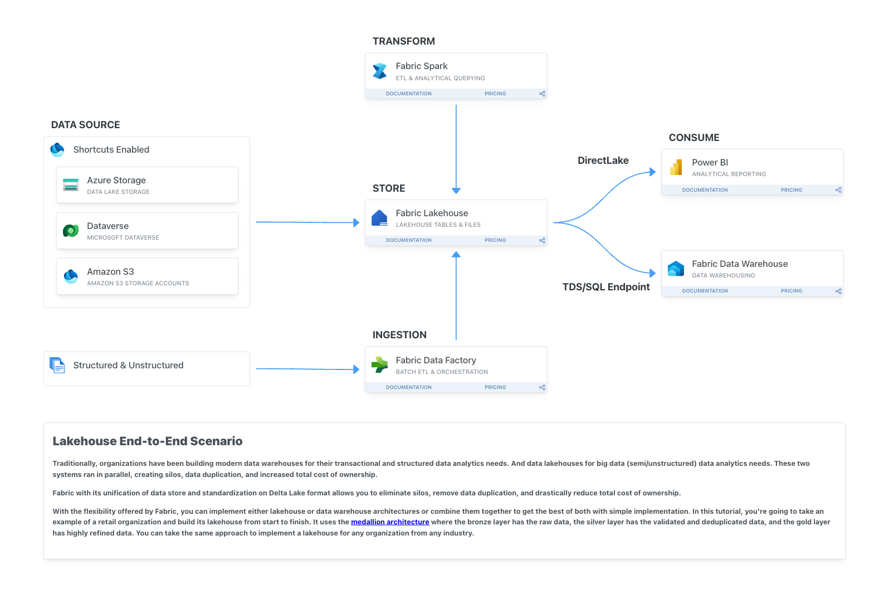

# Build Your First End to End Lakehouse Solution

> [!NOTE]
> Sunday, March 24, Workshop Hours: 9 am – 4 pm 

Join our lakehouse workshop to learn how you can build your own modern end-to-end data solutions using Microsoft Fabric. Gain hands on experience as we guide you through Fabric data integration capabilities including pipelines and dataflows to land data in your lakehouse. Next you will learn how you can further transform your data using notebooks and Spark, and organize, secure, and prepare all your data for serving. Finally, you will learn how different data personas including BI analysts and data scientists can leverage and build on top of the lakehouse data. 

By the end of this workshop, you should be well versed in Fabric Data Integration & Data Engineering topics and capable of building an end-to-end workflow that includes ingesting, preparing, serving and operationalizing your data solution. 

# Context
Within your team at an innovative tech startup, you are spearheading efforts to transform urban mobility and transportation analysis. 

**Your mission centers around leveraging the comprehensive datasets from New York City's taxi and for-hire vehicle operations to refine urban planning, streamline routes, forecast demand, and augment safety measures. With the aid of Microsoft Fabric, your squad is set to construct a detailed lakehouse solution adept at ingesting, processing, and scrutinizing TLC Trip Record Data to extract pertinent insights.**

This integrated lakehouse solution will empower your company to:
* Consolidate both historical and immediate data from various taxi services, offering a unified perspective on the urban transport landscape.
* Deploy sophisticated data analytics and machine learning techniques to forecast traffic conditions, enhance fleet allocation, and boost operational effectiveness.
* Supply informed suggestions to urban developers and government officials to aid in the advancement of infrastructure and traffic management.
* Elevate the travel experience by ensuring reliability, safety, and punctuality in transportation services.
* Forge a versatile data infrastructure poised to adjust to new trends in urban mobility and assimilate future data sources.

# Agenda

> [!IMPORTANT]
> 9:00 am - 9:30 am - [Introduction, Set Up and Overview of Fabric Data Platform](./start/start.md)
> 
> 9:30 am - 10:30 am - [Exercise 1](./exercise-1/exercise-1.md) 
> 
> 10:30 am - 10:45 am - Break 15 minutes
> 
> 10:45 am - 12:00 pm - [Exercise 2](./exercise-2/exercise-2.md)
> 
> 12:00 pm - 01:00 pm - Lunch 60 minutes
> 
> 01:05 pm - 01:35 pm - [Exercise 3](./exercise-3/exercise-3.md)
> 
> 01:35 pm - 01:40 pm - Break 5 minutes
> 
> 01:40 pm - 02:40 pm - [Exercise 4](./exercise-4/exercise-4.md)
> 
> 02:40 pm - 02:50 pm - Break 10 minutes
> 
> 02:50 pm - 03:30 pm - [Exercise 5](./exercise-5/exercise-5.md)
> 
> 03:30 pm - 04:00 pm - Recap

[Advanced, extra steps](./extra/extra.md).
