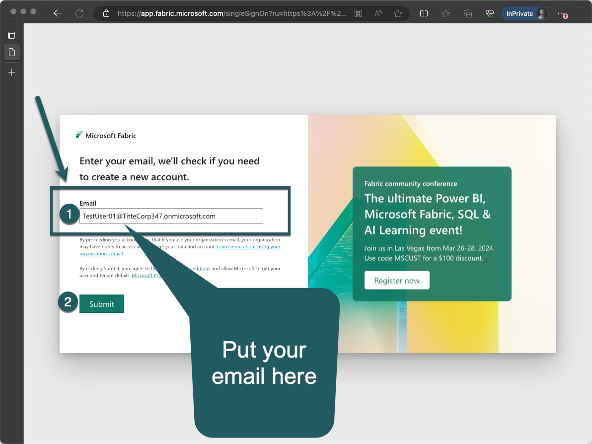
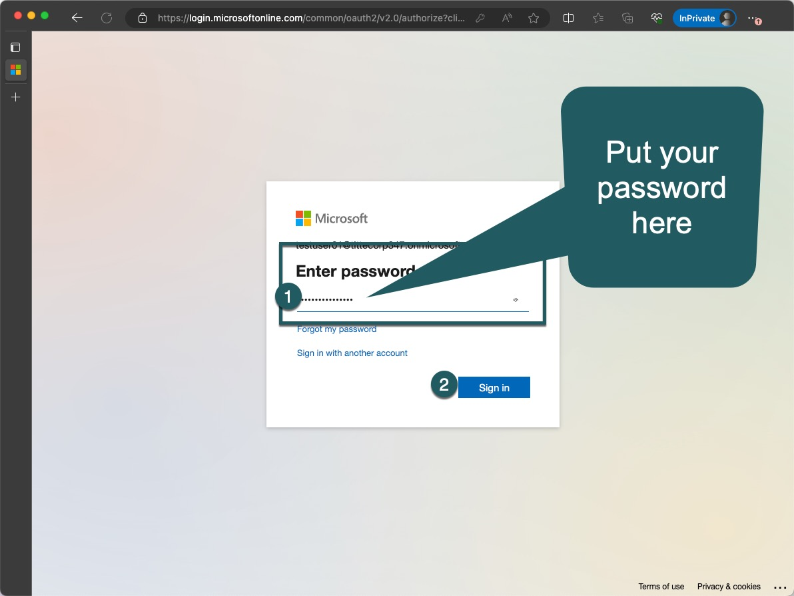
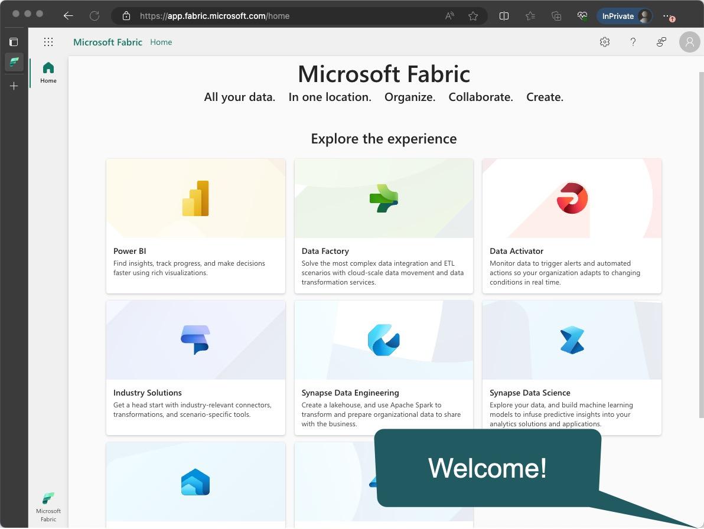
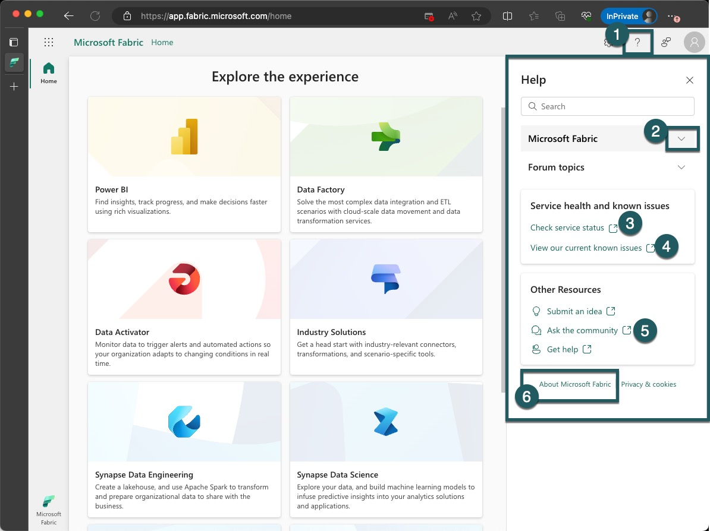

# Build-Your-First-End-to-End-Lakehouse-Solution

> Sunday, March 24, Workshop Hours: 9 am – 4 pm 

Join our lakehouse workshop to learn how you can build your own modern end-to-end data solutions using Microsoft Fabric. Gain hands on experience as we guide you through Fabric data integration capabilities including pipelines and dataflows to land data in your lakehouse. Next you will learn how you can further transform your data using notebooks and Spark, and organize, secure, and prepare all your data for serving. Finally, you will learn how different data personas including BI analysts and data scientists can leverage and build on top of the lakehouse data. 

By the end of this workshop, you should be well versed in Fabric Data Integration & Data Engineering topics and capable of building an end-to-end workflow that includes ingesting, preparing, serving and operationalizing your data solution. 

# Context
Within your team at an innovative tech startup, you are spearheading efforts to transform urban mobility and transportation analysis. **Your mission centers around leveraging the comprehensive datasets from New York City's taxi and for-hire vehicle operations to refine urban planning, streamline routes, forecast demand, and augment safety measures. With the aid of Microsoft Fabric, your squad is set to construct a detailed lakehouse solution adept at ingesting, processing, and scrutinizing TLC Trip Record Data to extract pertinent insights.**

This integrated lakehouse solution will empower your company to:
* Consolidate both historical and immediate data from various taxi services, offering a unified perspective on the urban transport landscape.
* Deploy sophisticated data analytics and machine learning techniques to forecast traffic conditions, enhance fleet allocation, and boost operational effectiveness.
* Supply informed suggestions to urban developers and government officials to aid in the advancement of infrastructure and traffic management.
* Elevate the travel experience by ensuring reliability, safety, and punctuality in transportation services.
* Forge a versatile data infrastructure poised to adjust to new trends in urban mobility and assimilate future data sources.

# Agenda

1. 9:00 - 9:30 - [Introduction, Set Up and Overview of Fabric Data Platform](./README.md#setup)
2. 9:30 - 10:30 - [Exercise 1](./exercise-1/exercise-1.md) 
3. 10:30 - 10:45 - Break
4. 10:45 - 12:00 - [Exercise 2](./exercise-2/exercise-2.md)
5. 12:00 - 01:00 - Lunch 
6. 01:05 - 02:15 - [Exercise 3](./exercise-3/exercise-3.md)
7. 02:15 - 02:30 - Break
8. 02:30 - 03:00 - [Exercise 4](./exercise-4/exercise-4.md)
8. 03:00 - 03:30 - [Exercise 5](./exercise-5/exercise-5.md)
9. 03:30 - 04:00 - Recap

# 1. Setup
> 9:00 - 9:30 am - Introduction, Set Up and Overview of Fabric Data Platform 

## Mandatory steps
Timebox: 75 minutes

1. Review the infographic. 

2. Go to https://fabric.microsoft.com/
3. 

4. 

5. 

6. 

7. 

8. 

9. 

10. 

11. Review the infographic. 

12. Create a Workspace (named as the login you got to fabric)
13. Assign Capacity
14. Check Admin Settings
15. Check Workloads
16. Review the infographic. 

17. Review [Utils and tools](#utils-and-tools).

> [!IMPORTANT]
> Once completed, go to [Exercise 1](./exercise-1/exercise-1.md) or continue with [Advanced steps below](#advanced-steps).

## Advanced steps
TODO

# Utils and tools

## Dataset used

Name: TODO
Source: https://www.nyc.gov/site/tlc/about/tlc-trip-record-data.page

## Name conventions

### Bronze Layer (Raw Data Management)
Lakehouse Name: `bronzerawdata`

Description: This is the foundational layer where raw data is ingested directly from various sources, including yellow and green taxi trip records, FHV trip records, and potentially other urban mobility datasets. The data is stored in its original, unmodified form. In the context of your workshop, this involves landing raw TLC Trip Record Data into this layer, ensuring that all raw data remains immutable and traceable for lineage purposes.

### Silver Layer (Refined Data Management)
Lakehouse Name: `silvercleansed`

Description: In this intermediate layer, data is cleansed, standardized, and enriched to resolve inconsistencies and prepare for more detailed analysis. This includes resolving issues with data quality, standardizing formats, and enriching taxi and FHV data with additional contextual information, such as weather conditions or traffic data. The goal here is to create a reliable, query-optimized dataset that supports more efficient analysis and reporting.

### Gold Layer (Curated Data Management)
Lakehouse Name: `goldcurrated`

Description: The highest level of the lakehouse, where data is further transformed, modeled, and summarized to support advanced analytics and business intelligence. This layer focuses on deriving actionable insights and supporting high-level decision-making. It could involve aggregating data into meaningful metrics, developing KPIs for urban transportation efficiency, or building machine learning models to predict future trends based on historical patterns.

## Resources
* https://microsoft.github.io/fabricnotes/

## 🧹 Clean Up

**Once you are done experimenting with Microsoft Fabric, we encourage you to always delete your resources to avoid unwanted charges to your account.**

- To learn about how to delete the resource group that contains your capacity from Microsoft Azure, see [this documentation](https://learn.microsoft.com/azure/azure-resource-manager/management/delete-resource-group?tabs=azure-portal#delete-resource-group/?WT.mc_id=academic-114547-leestott).
- To learn about how to delete your Fabric workspace, see [this documentation](https://learn.microsoft.com/fabric/data-engineering/tutorial-lakehouse-clean-up/?WT.mc_id=academic-114547-leestott).