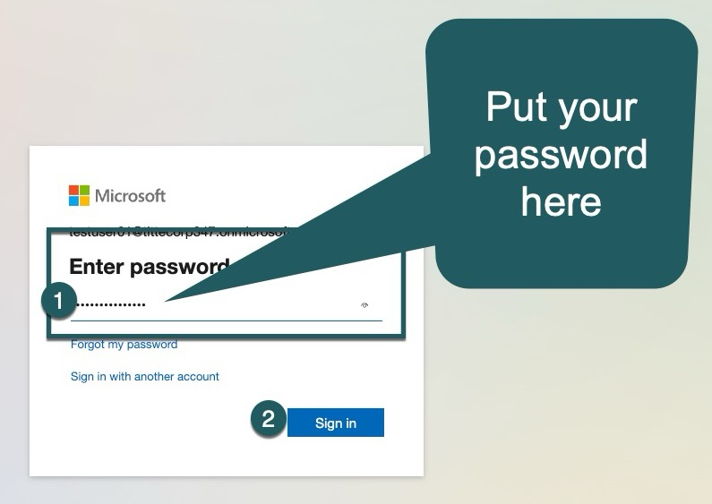
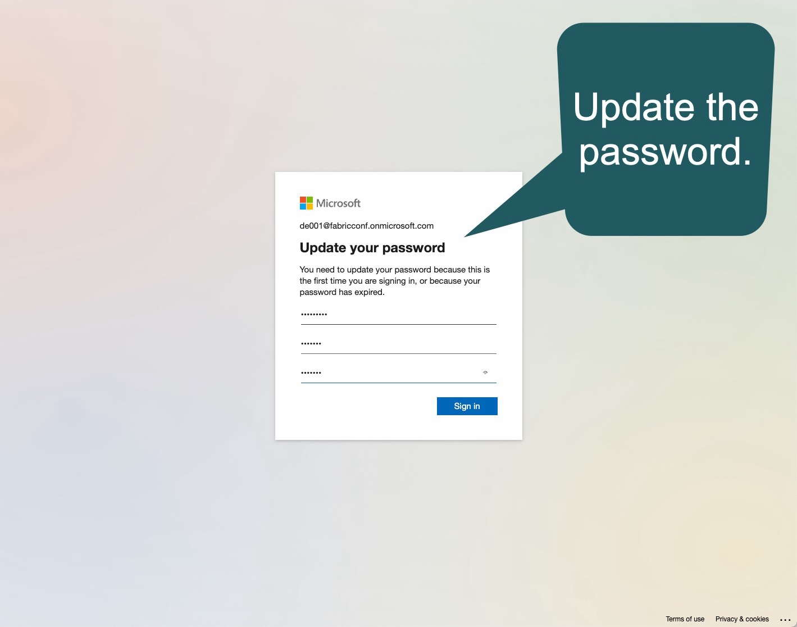
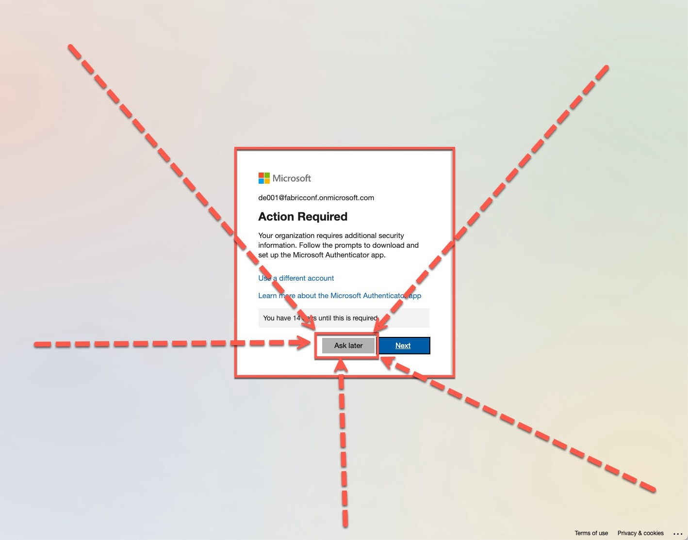
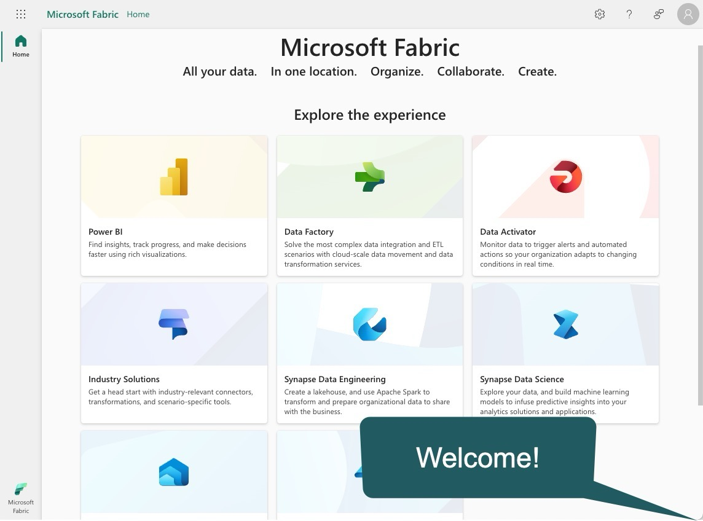
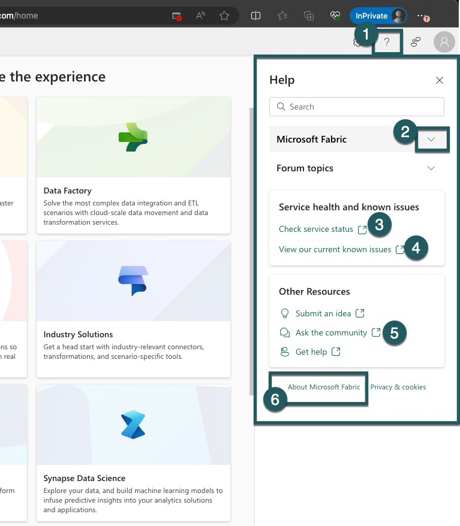
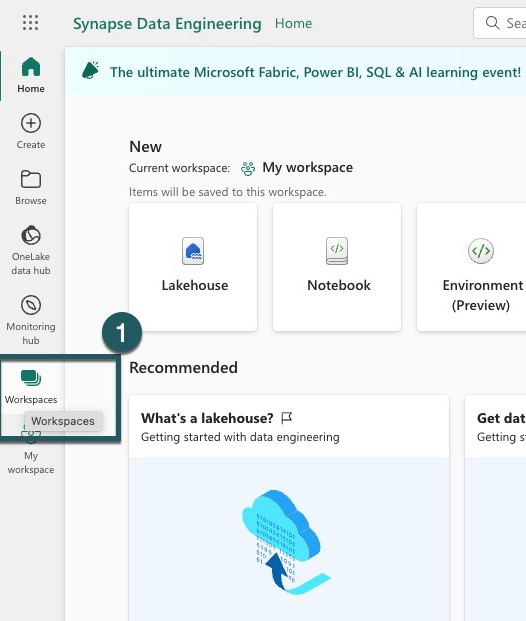
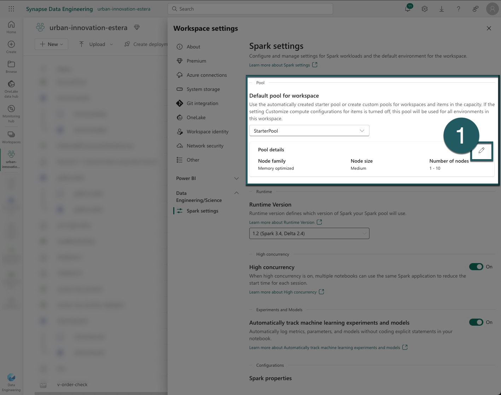

# Start & Setup
> [!NOTE]
> Timebox: 30 minutes | [Back to Agenda](./../README.md#agenda) | [Up next Exercise 1](./../exercise-1/exercise-1.md)
   
## 1. Navigate to the Microsoft Fabric Website

> [!TIP]
> We recommend using Incognito mode during this workshop to avoid automatic redirects related to your usual Fabric or Power BI tenants. Incognito prevents the browser from using your default work profile, making it easier to follow along without interruptions.

Visit the Microsoft Fabric website at https://fabric.microsoft.com/.

## 2. Log In with Assigned Credentials
Use the credentials provided on the business card located on your table.

## 3. Enter Your Password and Sign In
Input your password in the designated field and click the `Sign In` button.

## 4. Update Your Password
You are required to update your password upon first login. Please follow the prompts to do so.

> [!TIP]  
> **We advise you to write your password on the back side of the business card along with your login details, in case you may need to restart your PC and forget the password.**

## 5. Setup Multi-Factor Authentication (MFA)
As per Tenants' policy, setting up MFA is required. However, you can defer this by selecting `Ask Me Later.`

## 6. Welcome to Microsoft Fabric
You have successfully logged in to Microsoft Fabric!

## 7. Explore Workloads
Click the Microsoft Fabric icon in the bottom left corner to explore available workloads.

## 8. Explore Help Options
Use the on-screen numbers as a guide to explore all available help options.

## 9. Explore Settings and Admin Portal
Follow the on-screen instructions to explore the settings. Note that while you cannot configure settings due to access restrictions, you are welcome to browse.

## 10. Navigate Back and Create a Workspace
Return to the main screen and click on `Synapse Data Engineering` to begin creating a new workspace.

## 11. Access Workspaces
Click on the `Workspaces` icon located on the left part of the screen.

## 12. Create a New Workspace
A sidebar will appear with a list of all accessible subscriptions. Follow the instructions and click `New Workspace.`

## 13. Name Your Workspace
Give your new workspace a name, adhering to the provided naming convention. Verify the name and click `Apply.` Follow the naming convention and assign a name: `urban-innovation-deNNN`, where `NNN` represents the number assigned to you. For example, `urban-innovation-de001` (Estera’s workspace).

## 14. Workspace Creation Complete
Congratulations, your new workspace has been successfully created! This dedicated space is for you to innovate and build today.

## 15. Adjust default pool size to 2 nodes

To ensure smooth operation for multiple concurrent workshops happening today, you need to adjust the default configuration of the compute cluster in your Fabric workspace to scale down the maximum number of nodes to 2.

> [!NOTE]  
>  This task is crucial for optimizing resource usage and ensuring that the workshops run smoothly for all participants. By reducing the maximum number of nodes to 2, you help manage the load on the system and improve the experience for everyone involved.

1. **Navigate to Workspace Settings**:
   - Confirm that you are within the correct workspace view.
   - Access the workspace settings as indicated in the Fabric UI.

2. **Modify Default Pool Configuration**:
   - Go to Data Engineering / Data Science (it's under PowerBI) -> and then click on Spark settings. 
   - Locate the "default pool for workspace" setting.
   - Click on the pencil icon (marked as "1" in the provided screenshot) to edit the pool settings.

3. **Adjust Autoscale Settings and Save Changes**:
   - In the default pool configuration, change the autoscale maximum setting from 10 to 2. This limits the maximum number of nodes to 2 to prevent resource over-allocation.
   - Confirm and save your modifications to the default pool settings.

## 16. Download the exercise files
 
[Click here to download the repository as a Zip](https://github.com/ekote/Build-Your-First-End-to-End-Lakehouse-Solution/archive/refs/tags/fabcon.zip) or [here to download tar.gz package](https://github.com/ekote/Build-Your-First-End-to-End-Lakehouse-Solution/archive/refs/tags/fabcon.tar.gz) to your local machine. Alternatively, you can clone the [workshop GitHub repository](https://github.com/ekote/Build-Your-First-End-to-End-Lakehouse-Solution/tree/fabcon)."

---

> [!IMPORTANT]
> Once completed, proceed to [next exercise (Exercise 1)](./../exercise-1/exercise-1.md). If time permits before the next exercise begins, consider continuing with [extra steps](../exercise-extra/extra.md).
