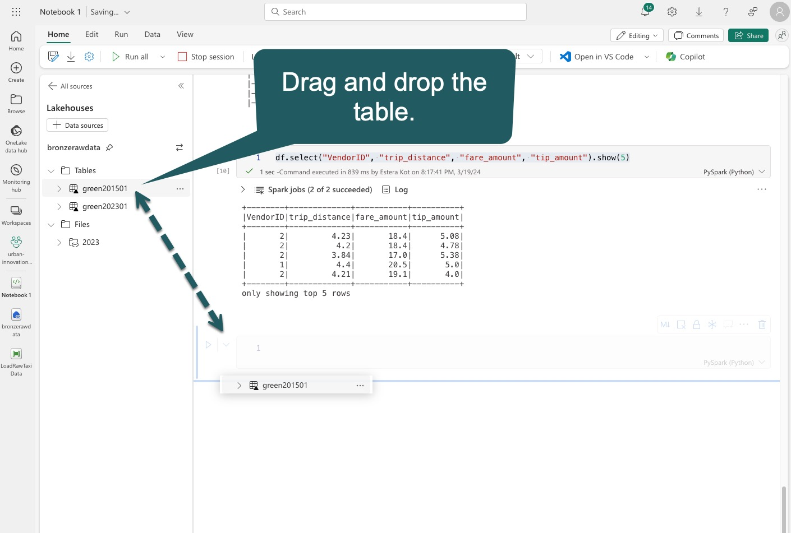
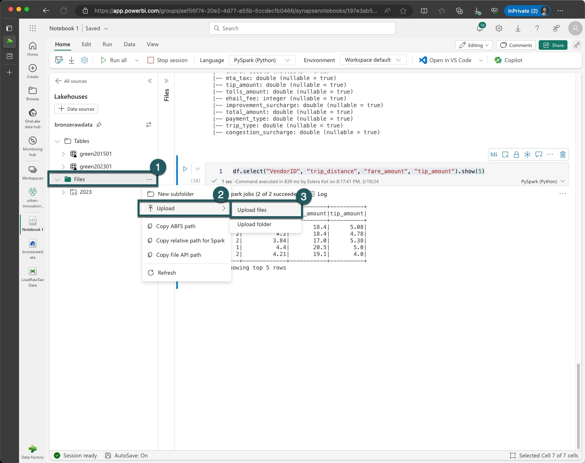
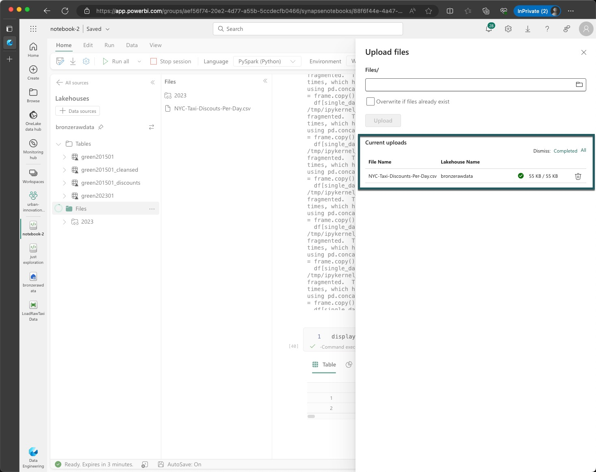
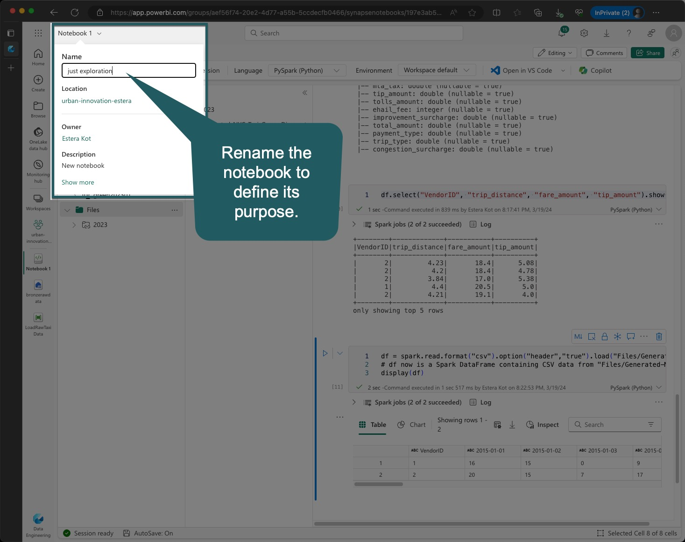
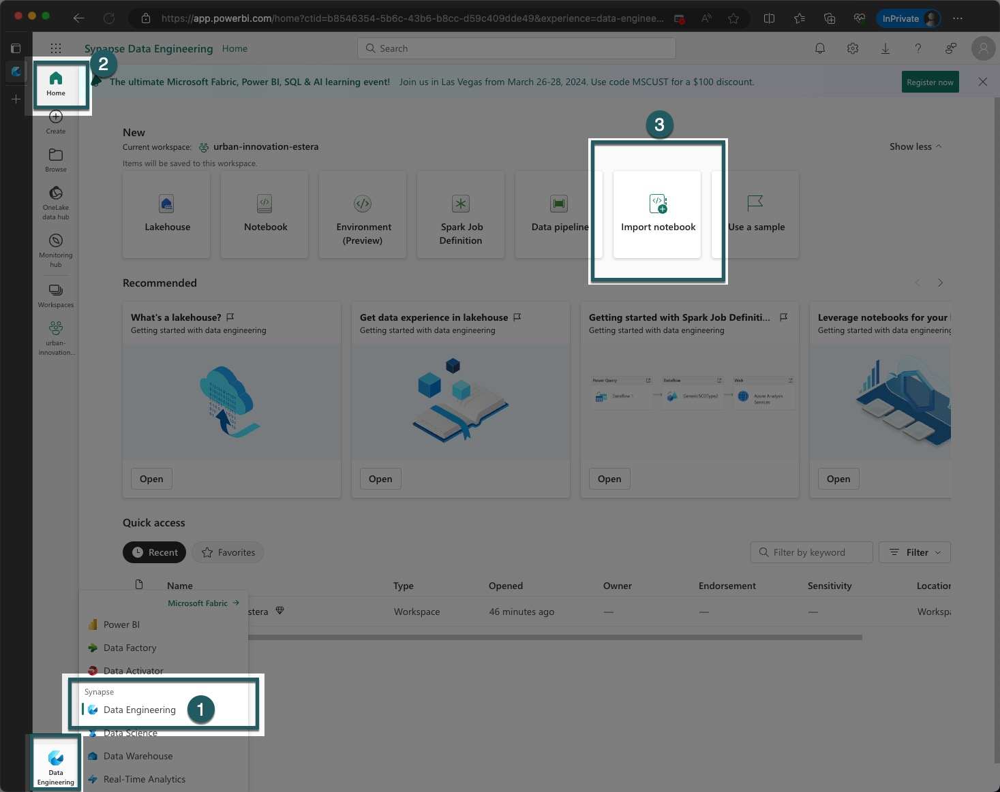
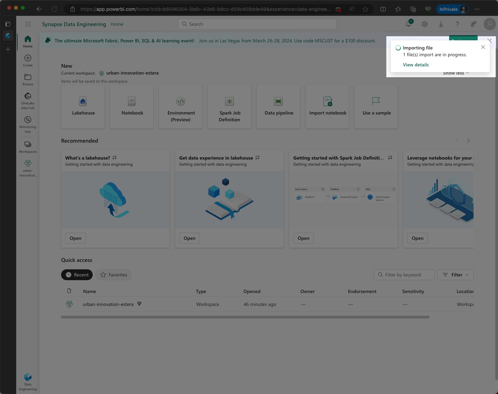
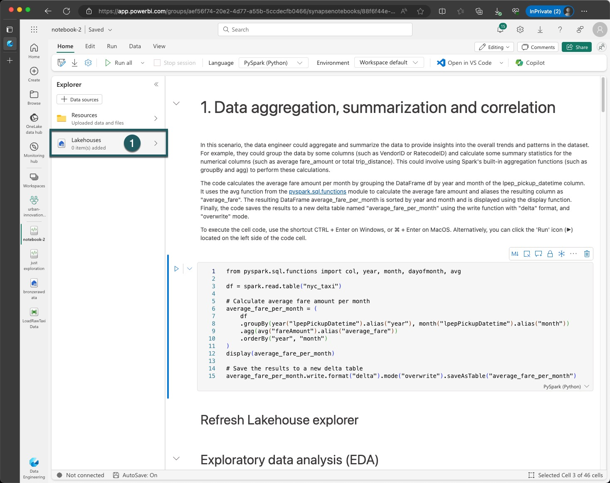
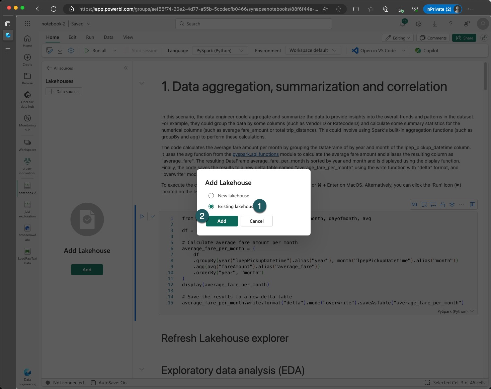
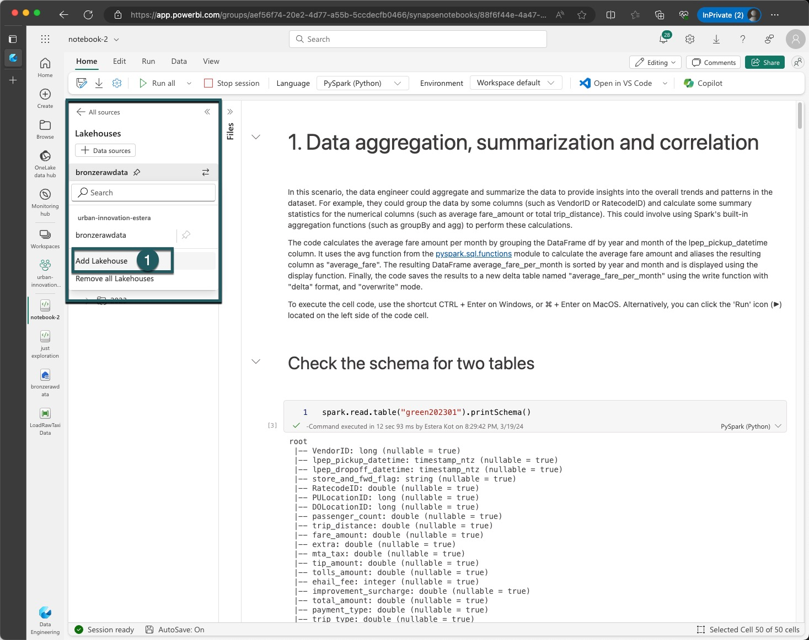

# Exercise 2 - Transform data using notebooks and Spark clusters 

> [!NOTE]
> Timebox: 75 minutes
> 
> Back to [Agenda](./../README.md#agenda)
> Back to [Exercise 1](./../exercise-1/exercise-1.md)

# Context
%TODO STORY


# Task 2.1 Copilot for notebooks

> Analyze my lakehouse table named green201501 and provide insights about the data.
> Can you calculate the average trip distance and fare amount for each payment type?


# Task 2.2 Different ways to get data from the lakehouse

To execute the cell code, use the shortcut CTRL + Enter on Windows, or ⌘ + Enter on MacOS. Alternatively, you can click the 'Run' icon (▶️) located on the left side of the code cell.

`df = spark.sql("SELECT * FROM bronzerawdata.green202301 LIMIT 1000")` - This line of code uses the `spark.sql()` function to run an SQL query on a table called `green202301` located in the lakehouse `bronzerawdata`. The query selects all columns `(*)` from the table and limits the result to the first 1000 rows with the `LIMIT 1000` clause. The result of the query is then stored in a PySpark DataFrame called `df`.
`display(df)` - the `display()` function is used to visualize the contents of a DataFrame in a tabular format. In this case, it visualizes the contents of the df DataFrame created in the previous line.

```pyspark
df = spark.sql("SELECT * FROM bronzerawdata.green202301 LIMIT 1000")
display(df)
```
Alternatively, you can use the %%sql magic in a notebook to run SQL statements.

```
%%sql
SELECT * FROM bronzerawdata.green202301 LIMIT 1000
```

The code `df.select("VendorID", "trip_distance", "fare_amount", "tip_amount").show(5)` is used to display the first five rows of a DataFrame called df, and only the columns named: "vendorID", "tripDistance", "fareAmount", "tipAmount". This is a useful function when working with large datasets to quickly inspect the data and ensure that it has been loaded correctly.

```df.select("VendorID", "trip_distance", "fare_amount", "tip_amount").show(5)```

When working with data, one of the initial tasks is to read it into the environment for analysis. Once the data is loaded, basic analysis such as filtering, sorting, and aggregating can be performed. However, as the scale and complexity of the data increase, there is a need for more advanced data engineering scenarios such as data cleansing, transformation, and aggregation. 


## Task 2.3 - Side Loading (local upload) and Load to Delta for CSV file

4. Download the file to your local machine: https://github.com/ekote/azure-architect/raw/master/part-00175-tid-4753095944193949832-fee7e113-666d-4114-9fcb-bcd3046479f3-2745-1.c000.parquet
5. Go to OneLake data hub > your Lakehouse
6. Upload the file
7. Use "Load to Table" feature











# Task 2.4 Import Notebook 
Your task is to import notebook and complete all exercises inside the notebook. 
Download notebook from the URL:





# Task 2.5 Attach the bronze Lakehouse





# Task 2.6 Create a silver lakehouse



# Task 2.7 - Follow the Notebook

Just read and follow all the exercises from the notebook.


# Task 2.8 - Automation 


# Task 2.9 - Confirm end result


# Task 2.10 - Recharge your batteries for the next exercise!


> [!IMPORTANT]
> Once completed, go to [Exercise 3](./../exercise-3/exercise-3.md) or continue with [Advanced steps below](#advanced-steps).


# Advanced steps

# PIVOT & Experimental Public Preview of Runtime 1.3


# Task 2.5 Spark vs Pandas
Your new team members wrote a lot of Pandas code and run it on big cluster. Your task is to explain the best practices to process big data.


# Task 2.6 Transform the data using Spark SQL and PySpark APIs
Your task is to factory the code produced by your colleague. 


# Task 2.7 Schedule notebook
Your task is to schedule notebook to run every hour.

Save, schedule and run the notebook as a job 

# Task 2.8 Workspace-level settings

# Task 2.9 Compute Settings


# Task 2.10 Environment


# Task 2.11 GIT


# Task 2.12 Saved with V-Order?


# Task 2.13 DW vs Lakehouse?


# Task 2.14 Pivot


# Task 2.15 Run OPTIMIZE cmd

# Task 2.16 CODE REVIEW in shared notebook


##  Medallion architecture
A Medallion architecture is a data design pattern used to organize data in a Lakehouse, with the goal of progressively improving the quality and structure of the data as it flows through each layer of the architecture, starting from the Bronze layer, then to the Silver layer, and finally to the Gold layer.


This incremental and progressive improvement enables you to maintain data quality and structure while also improving data processing performance. Medallion architectures are sometimes referred to as "multi-hop" architectures because data flows through multiple layers.

One of the main benefits of a Lakehouse architecture is that it provides a simple data model that is easy to understand and implement. Additionally, it enables incremental ETL (extract, transform, load) operations, which means you can add new data to the Lakehouse in a scalable and manageable way.

Another benefit of a Lakehouse architecture is that it allows you to recreate your tables from raw data at any time. This is possible because Delta Lake provides ACID transactions and time travel capabilities, allowing you to track changes to your data and easily roll back to previous versions if necessary.

Read more [here](https://techcommunity.microsoft.com/t5/analytics-on-azure-blog/simplify-your-lakehouse-architecture-with-azure-databricks-delta/ba-p/2027272).


### Medallion architecture in Fabric Lakehouse

After performing data cleaning and transformation on your Lakehouse data, you can save the resulting data back to another Lakehouse to reflect the "bronze->silver->gold" pattern.

Here's an example code snippet that shows how you can write data to another Lakehouse:


```python
# read data from the bronze Lakehouse
bronze_df = spark.read.table("bronze_lakehouse_name.lakehouse_table")

# perform data cleaning and transformation
# ...

# write the transformed data to the silver Lakehouse
transformed_df.write.format("delta").mode("overwrite").saveAsTable("silver_lakehouse_name.lakehouse_table")
```

In this example, we first read data from the bronze Lakehouse using the spark.read method. We then perform data cleaning and transformation on the bronze_df DataFrame. Finally, we write the transformed data to the silver Lakehouse using the transformed_df.write method, specifying the path to the silver Lakehouse and setting the save mode to "overwrite" to replace any existing data.

## Medallion Architecture Data Design and Lakehouse Patterns | Microsoft Fabric Data Factory

Watch Fabric Espresso episode as Abhishek and Estera discuss the Medallion Architecture Data Design and Lakehouse Patterns in Microsoft Fabric Data Factory.  

[](https://www.youtube.com/watch?v=706MVIBivOU)


## Deployments Pipelines


## Rest API


## Data Wrangler
TODO VIDEO


## MS SPARK UTILITIES - run another notebook reference run

TODO VIDEO

## Run multiple

> [!IMPORTANT]
> Once completed, go to [Exercise 3](./../exercise-3/exercise-3.md).