# Exercise 2 - Transform data using notebooks and Spark clusters 

> [!NOTE]
> Timebox: 75 minutes
> 
> Back to [Agenda](./../README.md#agenda) | [Exercise 1](./../exercise-1/exercise-1.md)

# Context
TODO

# Task 2.1 Copilot for notebooks

With Copilot for Data Science and Data Engineering, you can chat with an AI assistant that can help you handle your data analysis and visualization tasks. You can ask the Copilot questions about lakehouse tables, Power BI Datasets, or Pandas/Spark dataframes inside notebooks. Copilot answers in natural language or code snippets. Copilot can also generate data-specific code for you, depending on the task. For example, Copilot for Data Science and Data Engineering can generate code for:
* Chart creation 
* Filtering data 
* Applying transformations 
* Machine learning models


Investigate the 'green201501' table within your lakehouse, and seek insights about the dataset. Additionally, inquire how to compute the average trip distance and fare amount by each payment type.

## 1. Accessing Copilot
Select the Copilot icon found in the notebooks ribbon. This action opens the Copilot chat panel and creates a new cell at the top of your notebook. Note: This cell is essential for initializing a Spark session within a Fabric notebook and must be executed for Copilot to function correctly. Future releases may introduce alternative initialization methods.


## 2. Get Started with Copilot
When the Copilot panel opens, click 'Get Started' to initiate your interaction with the AI assistant.


## 3. Library Installation
Copilot will automatically insert a new cell containing the necessary library installation script. Execute this cell by clicking the 'Play' button to install the required libraries for Copilot functionalities.


## 4. Data Privacy and Security Awareness
Post-installation, you will be presented with a note on data privacy and security. Please read through this to understand how your data is stored and processed. Additionally, guidelines will be provided on how to effectively communicate with Copilot.


## 5. Interacting with Copilot
Now, engage with Copilot by exploring various prompts related to your data. Feel free to ask for code snippets, clarification, or paste the generated code into a new notebook cell. This is an opportunity to explore the capabilities and assistance Copilot offers for data science and engineering tasks.

> Analyze my lakehouse table named green201501 and provide insights about the data.
> 
> Can you calculate the average trip distance and fare amount for each payment type?


This quick demonstration aims to highlight the ease of accessing Copilot for insightful data analysis.


# Task 2.2 Different ways to get data from the lakehouse

This task focuses on various methods for extracting data from the lakehouse into your notebook for analysis. Below are step-by-step instructions to perform this in your notebook.

## 1. Code Execution Basics
Remember, to execute code within a cell, use CTRL + Enter on Windows or ⌘ + Enter on MacOS. Alternatively, the 'Run' icon (▶️) next to the code cell can be used.

## 2. Extracting Data Using PySpark
Enter the following PySpark code in a new cell in your Fabric notebook. This script will retrieve data from a specified lakehouse table. Make sure to replace bronzerawdata and green202301 with your lakehouse and table names if they differ.

```pyspark
df = spark.sql("SELECT * FROM bronzerawdata.green202301 LIMIT 1000")
display(df)
```

Explanation of the Code:
`df = spark.sql("SELECT * FROM bronzerawdata.green202301 LIMIT 1000")` - This line of code uses the `spark.sql()` function to run an SQL query on a table called `green202301` located in the lakehouse `bronzerawdata`. The query selects all columns `(*)` from the table and limits the result to the first 1000 rows with the `LIMIT 1000` clause. The result of the query is then stored in a PySpark DataFrame called `df`. `display(df)` - the `display()` function is used to visualize the contents of a DataFrame in a tabular format. In this case, it visualizes the contents of the df DataFrame created in the previous line.

## 3. Using Multiple Programming Languages in Fabric Notebooks
Fabric Notebooks support various programming languages, including PySpark, Scala, SQL, and R. To switch to SQL, for example, use the %%sql magic command at the beginning of a notebook cell.


```
%%sql
SELECT * FROM bronzerawdata.green202301 LIMIT 1000
```

Now, let's execute a specific data selection command. This command filters specific columns from the DataFrame and displays the first five rows:

```df.select("VendorID", "trip_distance", "fare_amount", "tip_amount").show(5)```

The code `df.select("VendorID", "trip_distance", "fare_amount", "tip_amount").show(5)` is used to display the first five rows of a DataFrame called df, and only the columns named: `vendorID`, `tripDistance`, `fareAmount`, `tipAmount`. This is a useful function when working with large datasets to quickly inspect the data and ensure that it has been loaded correctly.


## 4. Understanding Data Workflows
When working with large datasets, starting with data retrieval sets the foundation for subsequent data analysis tasks, which may include filtering, sorting, and aggregating data. As you delve deeper, you may encounter more complex data engineering tasks such as cleansing, transformation, and aggregation, essential for advanced data analysis and insights extraction.


# Task 2.3 - Side Loading (local upload) and Load to Delta for CSV file
This set of instructions will guide you through the process of downloading external data and integrating it into your Lakehouse for comprehensive analysis.

## 1. Downloading Data
Navigate to the [provided URL](https://raw.githubusercontent.com/ekote/Build-Your-First-End-to-End-Lakehouse-Solution/fabcon/exercise-2/NYC-Taxi-Discounts-Per-Day.csv) to download a CSV file containing information on discounts applied to users on a specific date. This data is vital for comprehensive analysis and is generated for your convenience. Download the file to your local machine from this link: Download Discount Data


## 2. Uploading Data to the Lakehouse
To integrate this discount data with existing datasets:
* Go to the 'Files' section in your Lakehouse. 
* Click on the three dots to access additional options and select the 'Upload' button. 
* Choose 'Upload Files' from the menu.


## 3. File Selection for Upload
Select the recently downloaded file, likely named NYC-Taxi-Discounts-Per-Day.csv, then initiate the upload by clicking the 'Upload' button.


## 4. Verifying Upload to the Lakehouse
The file should upload within a few seconds. This method provides a straightforward approach to augmenting your Lakehouse data.


## 5. Refreshing and Locating the File
Refresh the Lakehouse's 'Files' section to view the newly uploaded file. Employ the drag-and-drop feature to move this file into your notebook. This action will generate a cell prepopulated with code, which you can execute to review the new data.


## 6. Renaming the Notebook
Assign an appropriate name to your notebook reflecting its purpose, such as 'Data Exploration' or 'Discount Analysis', to maintain clarity and organization within your projects.


## 7. Switching to Data Engineering View
Finally, transition to the 'Data Engineering' tab, adhering to the instructions depicted on-screen, to continue your data analysis journey with the newly integrated datasets.


[//]: # (![Step]&#40;../media/2/8.jpg&#41;)


# Task 2.4 Import pre-made motebook 
> You can import one or more existing notebooks from your local computer to a Fabric workspace from the Data Engineering or the Data Science homepage. Fabric notebooks recognize the standard Jupyter Notebook .ipynb files, and source files like .py, .scala, and .sql, and create new notebook items accordingly.

## 1. Importing the Notebook
Ensure you are in the 'Data Engineering' context of your Fabric workspace. Then, navigate to the 'Home' section where you'll find an option to upload notebooks, symbolized by a notebook icon. Click this icon to open the upload sidebar, similar to how you previously uploaded a file. From here, choose the notebook you've recently downloaded, named notebook-2.ipynb, and initiate the upload.


## 2. Import Notification
Once you start the upload, you'll receive a notification indicating that the import of the file is underway. Wait for this process to complete; it typically takes only a few moments.


## 3. Accessing the Imported Notebook
After the import completes, locate the newly imported notebook in the 'Insight Workspace'. Click on the three dots associated with the notebook and select 'Open Notebook'. For convenience, you can open the notebook in the background, which will make its icon continuously accessible from the vertical sidebar on the left.


Congratulations, you've successfully completed the task and enhanced your data engineering capabilities with a pre-made notebook!


# Task 2.5 Attach the bronze Lakehouse
This step-by-step guide will help you to integrate your Lakehouse with the pre-made notebook for effective data manipulation and analysis.

## 1. Accessing Lakehouse Options
In your opened notebook, locate the section referring to Lakehouses, typically shown in the screenshot provided within the notebook. Click on this section to view your Lakehouse options.


## 2. Adding a Lakehouse
Within the Lakehouse options, click on the 'Add' button to initiate the process of linking a Lakehouse to your notebook.


## 3. Selecting the Existing Lakehouse
Choose the option to select an 'Existing Lakehouse' from the available choices. After making this selection, click the 'Add' button to proceed.


## 4. Choosing Your Lakehouse
From the list of available Lakehouses, identify and select your own, named 'bronzerawdata' or similar, based on your project or team naming conventions. Be careful to choose the correct one to ensure accurate data analysis. Once confirmed, click 'Add' to attach it to your notebook.


## 5. Confirmation
Verify that your Lakehouse, 'bronzerawdata', is now correctly linked and visible within your notebook settings. This confirmation ensures that you are all set for executing data-related tasks within the notebook.


# Task 2.6 Create a silver lakehouse
The last task before fully immersing ourselves in data engineering work within the notebook is to create and attach a new Silver Lakehouse. Please follow these steps:

## 1. Click on the pin icon next to the Default Lakehouse, 'bronzerawdata'. Then select 'Add Lakehouse'.


## 2. Choose 'New Lakehouse' and click 'Add'.


## 3. Follow the naming convention and enter a name for the Lakehouse. The suggested name is 'silvercleansed'.


## 4. Confirm that your notebook is now linked to two Lakehouses: the default one (bronze) and the newly added one (silver). Once this is verified, we can begin our data engineering work.


# Task 2.7 - Follow the Notebook

In this task, follow the notebooks and the code provided, as well as all the instructions written in the code. You will complete the notebook task once you see the last sale for the notebook displayed on the screen. 

Good luck.


# Task 2.8 - Automation 

Congratulations, you have completed the advanced data engineering notebook. Now, let's focus on automation. Considering we have just two tables, imagine the scenario where you need to process 50 tables or 50 different Parquet data sources. In such cases, the most efficient approach is to build and prioritize a data pipeline. This is the aim of the task at hand – to establish automation.

## Pre-Automation Quality Check
Ensure the following before starting the automation process:
* Lakehouse bronzerawdata contains two tables: green201501 and green201301.
* Lakehouse bronzerawdata includes one folder in the Files section, named 2023, created by a shortcut.
* Lakehouse bronzerawdata has one file in the Files section: NYC-Taxi-Discounts-Per-Day.csv.
* Lakehouse silvercleansed consists of three tables: avg_fare_per_month, green201501_cleansed, and green201501_discounts.

Once all is set, proceed with the automation.

## 1. **Starting Point**
Navigate to 'Home' as depicted in the instructions.


## 2. **Data Pipeline Creation**
Click on 'Data Pipeline' and name the new pipeline `Bronze2Silver`.
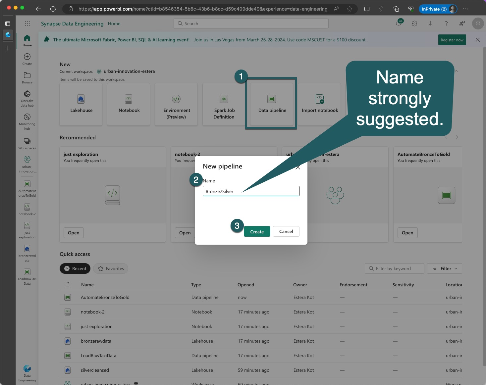

## 3. **Pipeline Activity**
Select the 'ForEach' activity as shown on the screen.


## 4. **General Settings for Each Activity**
Provide a name for each 'ForEach' element.
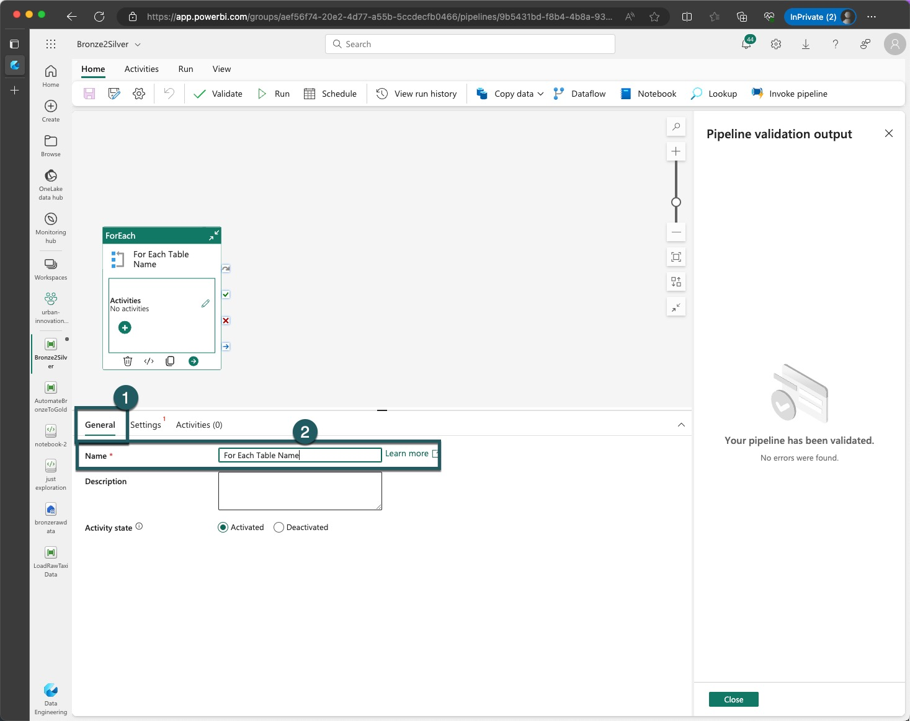

## 5. **Pipeline Variables**
In the pipeline settings tab, navigate to 'Variables'. Here, create a new variable named `table_name`, set its type to `Array`, and assign the default value `["green201501", "green202301"]`.
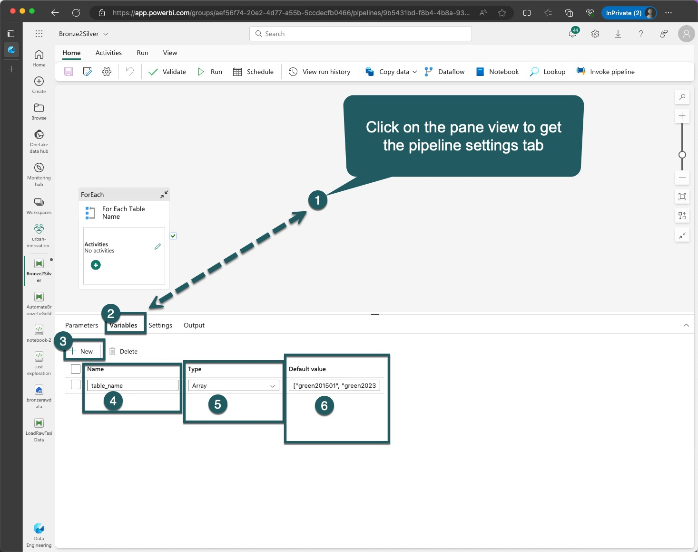

## 6. **ForEach Settings**
In the 'ForEach' settings, select 'Sequential' and specify '10' under 'Batch Count'. To add dynamic content, open the sidebar and select the 'table_name' variable. Confirm by clicking 'OK'.
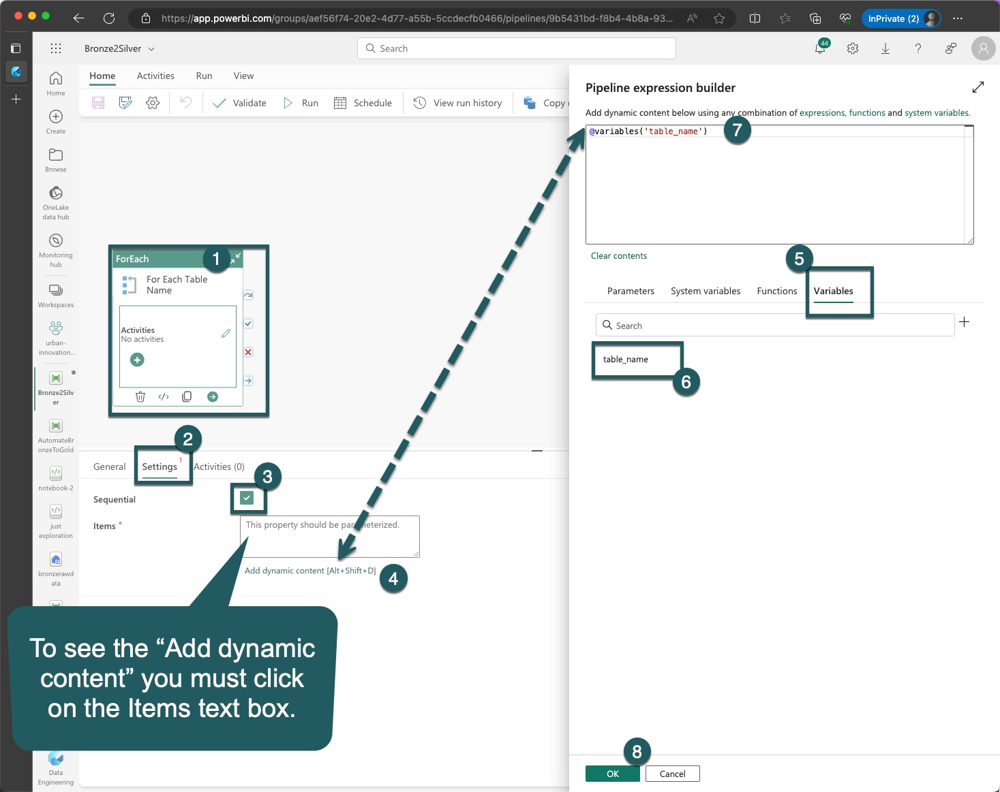

## 7. **Adding Notebook Activity**
Under 'Activities', choose 'Notebook'.
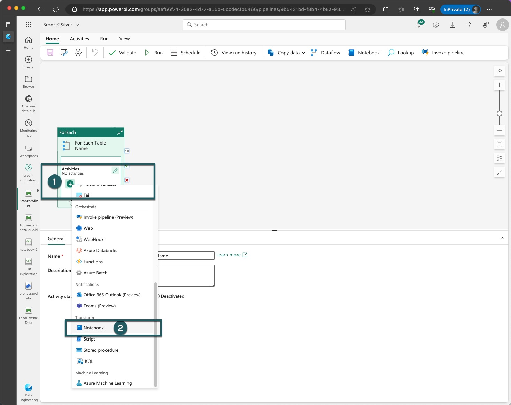

## 8. **Notebook Settings**
Access the 'Settings' tab for the notebook as illustrated.
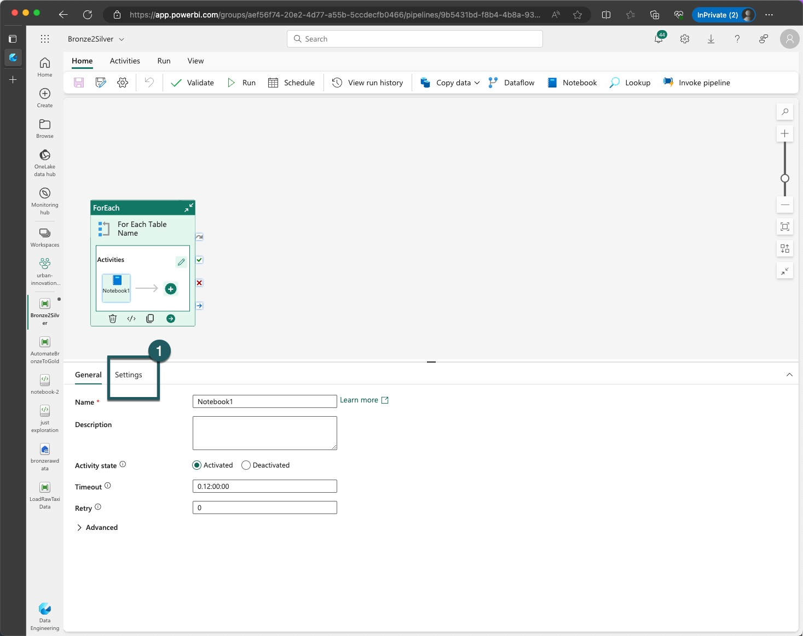

## 9. **Select Workspace**
Choose your workspace.


## 10. **Select Notebook and Base Parameters**
Opt for the 'notebook-2' that you uploaded previously.
Add a new parameter named `table_name`, with type 'String' and value `@items()`.

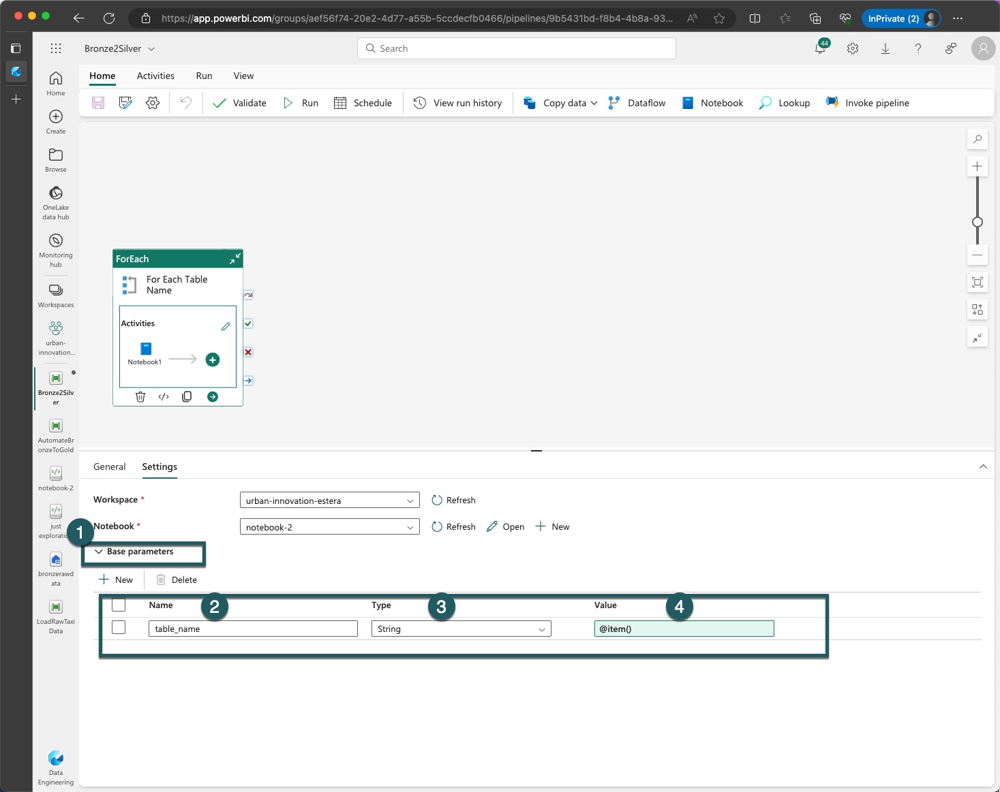

## 11. **Validation**
After configuring, click 'Validate' to ensure there are no errors. Click on 'Run'.


## 12. **Execution**
Save the settings and initiate the run by clicking the 'Run' button.
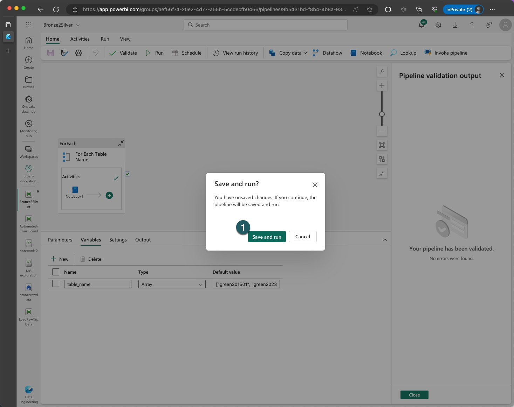

## 13. **Observation and Optimization**
Note that the execution of the two notebooks occurs sequentially, typically taking two minutes each. However, as these notebooks do not depend on each other, consider modifying the pipeline to run the notebooks in parallel for efficiency.


Congratulations on completing this significant milestone in data engineering automation! Your skills in automating data processes have now been markedly enhanced.


# Task 2.9 - Confirm End Results

Upon completing Exercises 1 and 2, it's crucial to verify the following outcomes in your Lakehouse environments:

## Lakehouse `bronzerawdata` Confirmation:
1. **Tables**: Ensure there are two tables present: `green201501` and `green202301`.
2. **Files Section**: Confirm there is one folder named `2023`, created via the shortcut.
3. **File Existence**: Verify there is one file in the Files section: `NYC-Taxi-Discounts-Per-Day.csv`.

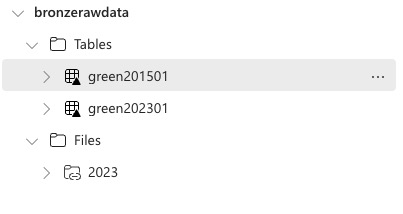


## Lakehouse `silvercleansed` Confirmation:
1. **Tables**: Check that there are six tables:
   - `avg_fare_per_month_2015_01`
   - `green201501_cleansed`
   - `green201501_discounts`
   - `avg_fare_per_month_2023_01`
   - `green202301_cleansed`
   - `green202301_discounts`.

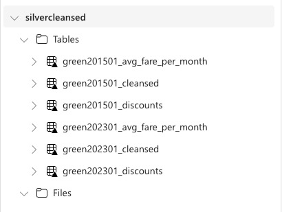

Review the screenshots provided to compare and confirm the setup in your Lakehouses matches the expected structure.

# Task 2.10 Create Gold Lakehouse (Requirement for Exercise 4)

The final task before delving into data science work (Exercise 4) within the notebook is to create a new Gold Lakehouse named `goldcurated`.

Please follow these steps:
## 1. From the view of all artifacts you have created inside your workspace, click on the 'New' button.
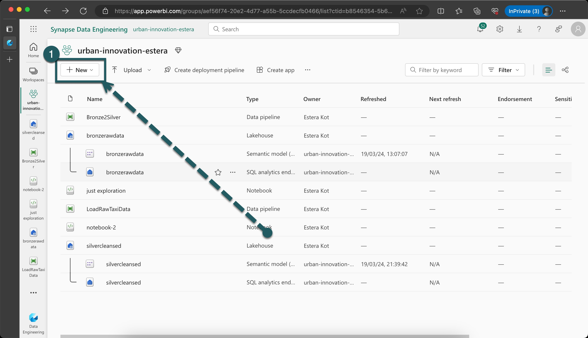

## 2. Then select 'Lakehouse' from the extensive list.
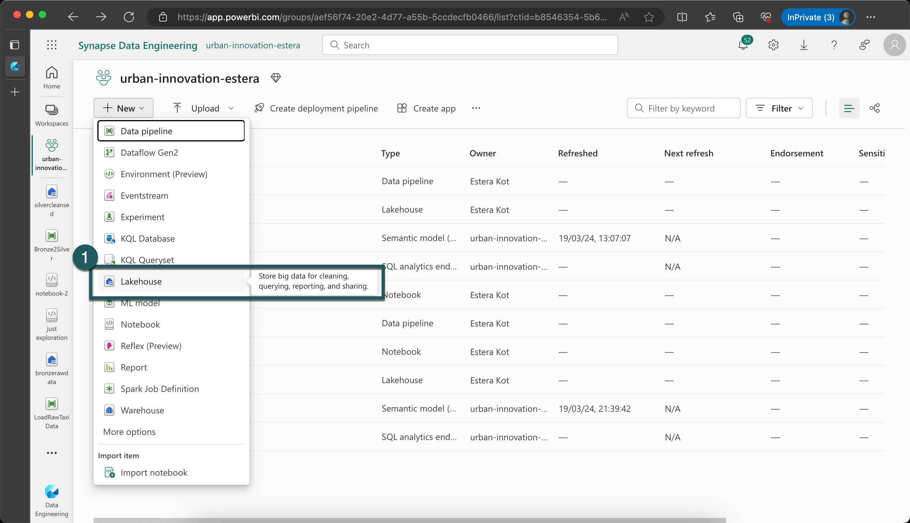

## 3. Adhere to the naming convention and enter a name for the Lakehouse. The suggested name is 'goldcurated'.
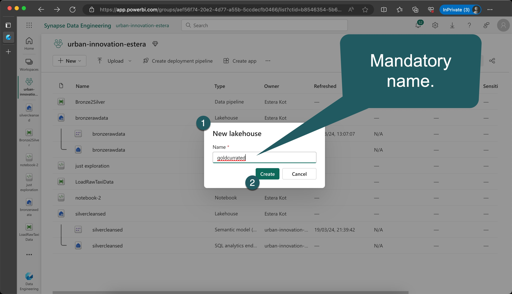

## 4. Confirm that your Gold Lakehouse has been created.


If all elements align with the requirements above, you're ready to move on to the next exercise, whether it's during a break, lunch, or an advanced step.


> [!IMPORTANT]
> Once completed, go to [Exercise 3](./../exercise-3/exercise-3.md). If time permits before the next exercise begins, consider continuing with [Advanced steps](./../extra/extra.md).

