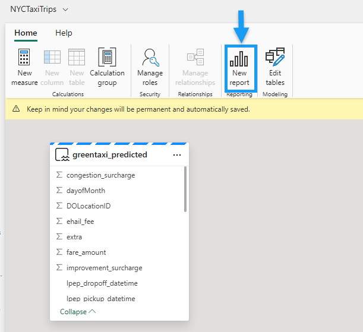
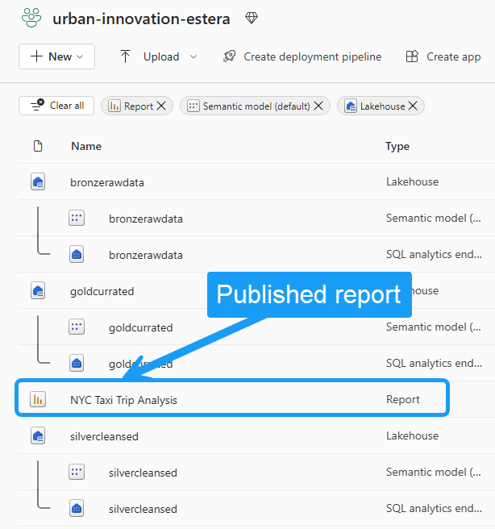

# Exercise 4 - Serve and consume data using Power BI and Data Science 

> [!NOTE]
> Timebox: 60 minutes
> 
> [Back to Agenda](./../README.md#agenda) | [Back to Exercise 3](./../exercise-3/exercise-3.md) | [Up next Exercise 5](./../exercise-5/exercise-5.md)
> #### List of exercises:
> * [Task 4.1 Predict Trip Duration Using Data Science in Fabric Lakehouse](#task-41-predict-trip-duration-using-data-science-in-fabric-lakehouse)
> * [Task 4.2 Explore and Visualize Taxi Trip Data Using Power BI and Direct Lake](#task-42-explore-and-visualize-taxi-trip-data-using-power-bi-and-direct-lake)
> * [Task 4.3 Publish and Share the Power BI Report](#task-43-publish-and-share-the-power-bi-report)

# Context

The data in your lakehouse tables is included in a dataset that defines a relational model for your data. You can edit this dataset, defining custom measures, hierarchies, aggregations, and other elements of a data model. You can then use the dataset as the source for a Power BI report that enables you to visualize and analyze the data.

You can leverage the **DirectLake** feature to create Power BI datasets directly on top of your data stored in the Lakehouse. DirectLake enhances query performance when dealing with large data volumes and seamlessly integrates with Lakehouse workloads that read and write Parquet files. By combining the data visualization capabilities of Power BI with the centralized storage and tabular schema of a data lakehouse, you can implement an end-to-end analytics solution on a single platform.

**Fabric enables you to visualize** the results of a single query or your entire data warehouse, **without leaving the data warehouse experience**. Exploring data while you work to ensure you have all the necessary data and transformations for your analysis is particularly useful.

Use the **Visualize button** to create a new Power BI report from the results of your query. Creating a new report with the results of your query will open a Power BI window.

You can also use the **New report button** to create a new Power BI report from the contents of your entire data warehouse. Using the New report button opens the Power BI service experience where you can build and save your report for use by the business.

---

# DirectLake vs DirectQuery in Power BI

Power BI is natively integrated in the whole Fabric experience. This native integration brings a unique mode, called DirectLake, of accessing the data from the lakehouse to provide the most performant query and reporting experience. DirectLake mode is a groundbreaking new engine capability to analyze very large datasets in Power BI. The technology is based on the idea of loading parquet-formatted files directly from a data lake without having to query a data warehouse or lakehouse endpoint, and without having to import or duplicate data into a Power BI dataset. DirectLake is a fast path to load the data from the data lake straight into the Power BI engine, ready for analysis.

In traditional DirectQuery mode, the Power BI engine queries the data directly from the data source every time it's queried and hence query performance depends on the speed data can be retrieved from the data source. This method avoids having to copy the data; any changes at the source are immediately reflected in the query results while in the import mode. And yet performance is better because the data is readily available in memory without having to query the data source each time. However, the Power BI engine must first copy the data into the dataset at refresh time. Any changes at the source are only picked up during the next data refresh.

DirectLake mode now eliminates this import requirement by loading the data files directly into memory. Because there's no explicit import process, it's possible to pick up any changes at the source as they occur, thus combining the advantages of DirectQuery and import mode while avoiding their disadvantages. DirectLake mode is therefore the ideal choice for analyzing very large datasets and datasets with frequent updates at the source.

---

# Task 4.1 Predict Trip Duration Using Data Science in Fabric Lakehouse

In this exercise, you will take on the role of a data scientist tasked with exploring, cleaning, and transforming a dataset containing taxi trip data. You will build a machine learning model to predict the duration of taxi trips using the New York taxi greencab dataset from 2009 to 2018, which includes information like pickup and drop-off times, locations, fares, and passenger counts.

1. **Download the Exercise Notebook**:
   - Download the provided Jupyter notebook, [Exercise 4 - Consume Data using Data Science](Exercise%204%20-%20Consume%20Data%20using%20Data%20Science.ipynb), to your local computer. This notebook contains the steps you will follow to complete the task.

2. **Import the Notebook into Fabric Workspace**:
   - Navigate to your Fabric workspace, either in the Data Engineering or Data Science section.
   - Import the downloaded notebook by following the instructions provided in [Exercise 2 - Importing Notebooks](../exercise-2/exercise-2.md#1-importing-the-notebook). This involves selecting the option to import existing notebooks and choosing the downloaded .ipynb file from your local computer.

3. **Follow Notebook Instructions**:
   - Once the notebook is imported into your Fabric workspace, open it.
   - Follow the detailed steps outlined within the notebook. These will guide you through:
     - Data exploration and cleaning: Understand the dataset's structure, clean any inconsistencies, and prepare the data for modeling.
     - Feature engineering: Create new features from the existing data to help improve the predictive power of your machine learning model.
     - Model training: Select and train a machine learning model using the prepared dataset.
     - Evaluation: Assess the performance of your model based on standard metrics.

4. **Complete the Exercise**:
   - Work through each step in the notebook, executing code cells and noting any insights or observations.
   - Make sure to save your progress as you work through the notebook.

---

# Task 4.2 Explore and Visualize Taxi Trip Data Using Power BI and Direct Lake

In this exercise, you will explore and visualize taxi trip data, including the predicted trip durations from the machine learning model you developed in Task 4.1. You will use Microsoft Fabric's Direct Lake feature for direct connectivity and create a Power BI report to analyze the data.

### Steps to Follow

1. **Access the Lakehouse Artifact**:
   - Navigate to the "goldcurated" lakehouse artifact within your workspace, used in previous exercises.
   - Open the lakehouse UI to begin working with the data.

2. **Create a New Semantic Model**:
   - Click the "New semantic model" button on the top ribbon.
   - In the dialog, name the semantic model (e.g., NYCTaxiTrips) and select **greentaxi_predicted** as the data source. Confirm to create the semantic model linked to your predictive data.
     

3. **Generate a New Power BI Report**:
   - In the semantic model UI, click the ***New report*** button on the top ribbon. This will open the Power BI report authoring page in a new browser tab.
   
     

> [!IMPORTANT]  
> You can now create various visuals as per your requirement to generate insights from the prediction dataset or follow the steps outlined below.

#### Sample Visuals to analyze predictedTripDuration.

1. Create a Slicer visualization for pickupDate.
    - Select the slicer option from the visualizations pane and select ***pickupDate*** from the data pane and drop it on the created slicer visualization field of the date slider visual.

2. Visualize Average tripDuration and predictedTripDuration by timeBins using a clustered column chart.
    - Add a clustered column chart, add ***timeBins*** to X-axis, ***trip_duration*** and ***predictedtrip_duration* **to Y-axis and change the aggregation method to Average.

3. Visualize Average tripDuration and predictedTripDuration by weekDayName.
    - Add an area chart visual and add ***weekDayName* **onto X-axis, ***trip_duration*** to Y-axis and ***predictedTripDuration*** to secondary Y-axis. Switch aggregation method to Average for both Y-axes.

4. Add Card visuals for overall predictedTripDuration and tripDuration.
   - Add a Card Visual and add predictedTripDuration to the fields and switch aggregation method to Average.
   - Add a Card Visual and add TripDuration to the fields and switch aggregation method to Average.

5. Visualize Average tripDuration and predictedTripDuration by pickupDate using line chart.
    - Add a line chart visual and add ***pickupDate*** onto X-axis, ***tripDuration*** and ***predictedTripDuration*** to Y-axis and switch aggregation method to Average for both fields.

6. Create Card Visuals for single view of key metrics.
   - Add a Card visual and drag ***tip_amount*** to fields and switch aggregation method to median.
   - Add 2nd Card visual and drag ***fare_amount*** to fields and switch aggregation method to average.
   - Add 3rd Card visual and drag ***predictedtrip_duration*** to fields and switch aggregation method to average. 
   - Add 4th Card visual and drag ***trip_duration*** to fields and switch aggregation method to average.

  You can now rearrange the layout and modify the aesthetics of the visuals as per your requirement and the report is ready to be published.

  

> [!TIP]
> Remember to save and publish your report, making it accessible to stakeholders for review and decision-making.

---

# Task 4.3 Publish and Share the Power BI Report

In this task, you will publish the Power BI report created in the previous task to your Power BI workspace and share it with other users within your organization.

1. **Save and Name the Report**:
   - In the Power BI report editor, navigate to the File menu and select the Save or Save As option to open the report save dialog box.
   - Enter a name for your report, for example, *NYC Taxi Trip Analysis*.
   - Choose a target workspace within Power BI where you want the report to be published and click Save.
     

2. **Publish the Report**:
   - Once saved, your Power BI report will be available as an artifact in the chosen workspace, ready for sharing and consumption.
     

3. **Share the Report**:
   - Open the published report from your workspace.
   - Click on ‘Share’ from the top navigation bar to open the sharing options.
   - In the ‘Send link’ dialog, choose whether to copy the sharing link or share it directly via Outlook, PowerPoint, and Teams to people in your organization.
   - Set the appropriate permissions for the report. Typically, you can allow recipients to view and interact with the report without granting editing permissions.

> [!TIP]
> Ensure that the report is correctly formatted and contains all relevant insights before sharing. Also, be mindful of data privacy and security when sharing reports, especially if they contain sensitive information. Review the [Sharing and Collaboration](https://learn.microsoft.com/en-us/power-bi/collaborate-share/service-share-dashboards) guide from Microsoft for more details on sharing options and best practices. This task will help you understand how to effectively disseminate information and insights gained from your data analysis within your organization.

---

> [!IMPORTANT]
> Once completed, go to [next exercise (Exercise 5)](./../exercise-5/exercise-5.md). If time permits before the next exercise begins, consider continuing with [extra steps](./../extra/extra.md).
