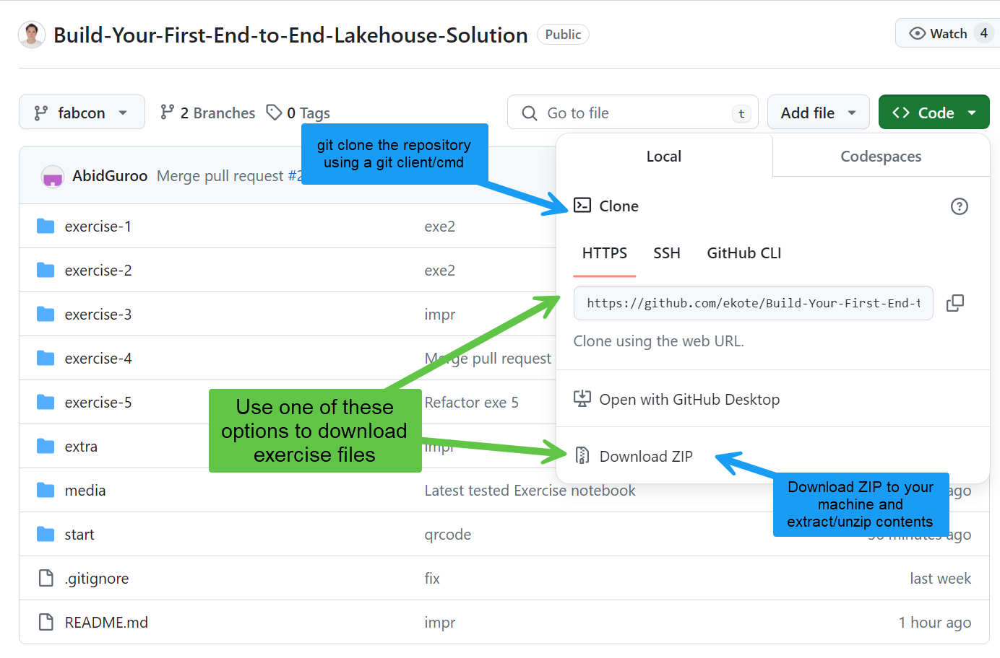

# Start
> [!NOTE]
> Timebox: 30 minutes | [Back to Agenda](./../README.md#agenda) | [Up next Exercise 1](./../exercise-1/exercise-1.md)

## 1. Navigate to the Microsoft Fabric Website

> [!TIP]
> We recommend using Incognito mode during this workshop to avoid automatic redirects related to your usual Fabric or Power BI tenants. Incognito prevents the browser from using your default work profile, making it easier to follow along without interruptions.

Visit the Microsoft Fabric website at https://fabric.microsoft.com/.

## 2. Log In with Assigned Credentials
Use the credentials provided on the business card located on your table.

## 3. Enter Your Password and Sign In
Input your password in the designated field and click the `Sign In` button.

## 4. Update Your Password
You are required to update your password upon first login. Please follow the prompts to do so.

## 5. Setup Multi-Factor Authentication (MFA)
As per Tenants' policy, setting up MFA is required. However, you can defer this by selecting `Ask Me Later.`

## 6. Welcome to Microsoft Fabric
You have successfully logged in to Microsoft Fabric!

## 7. Explore Workloads
Click the Microsoft Fabric icon in the bottom left corner to explore available workloads.

## 8. Explore Help Options
Use the on-screen numbers as a guide to explore all available help options.

## 9. Explore Settings and Admin Portal
Follow the on-screen instructions to explore the settings. Note that while you cannot configure settings due to access restrictions, you are welcome to browse.

## 10. Navigate Back and Create a Workspace
Return to the main screen and click on `Synapse Data Engineering` to begin creating a new workspace.

## 11. Access Workspaces
Click on the `Workspaces` icon located on the left part of the screen.

## 12. Create a New Workspace
A sidebar will appear with a list of all accessible subscriptions. Follow the instructions and click `New Workspace.`

## 13. Name Your Workspace
Give your new workspace a name, adhering to the provided naming convention. Verify the name and click `Apply.` Follow the naming convention and assign a name: `urban-innovation-deNNN`, where `NNN` represents the number assigned to you. For example, `urban-innovation-de001` (Estera’s workspace).

## 14. Workspace Creation Complete
Congratulations, your new workspace has been successfully created! This dedicated space is for you to innovate and build today.

## 15. Download the exercise files
Clone the workshop GitHub repository or Download Zip of the repository to your local machine.

---

> [!IMPORTANT]
> Once completed, proceed to [next exercise (Exercise 1)](./../exercise-1/exercise-1.md). If time permits before the next exercise begins, consider continuing with [extra steps](./../extra/extra.md).
