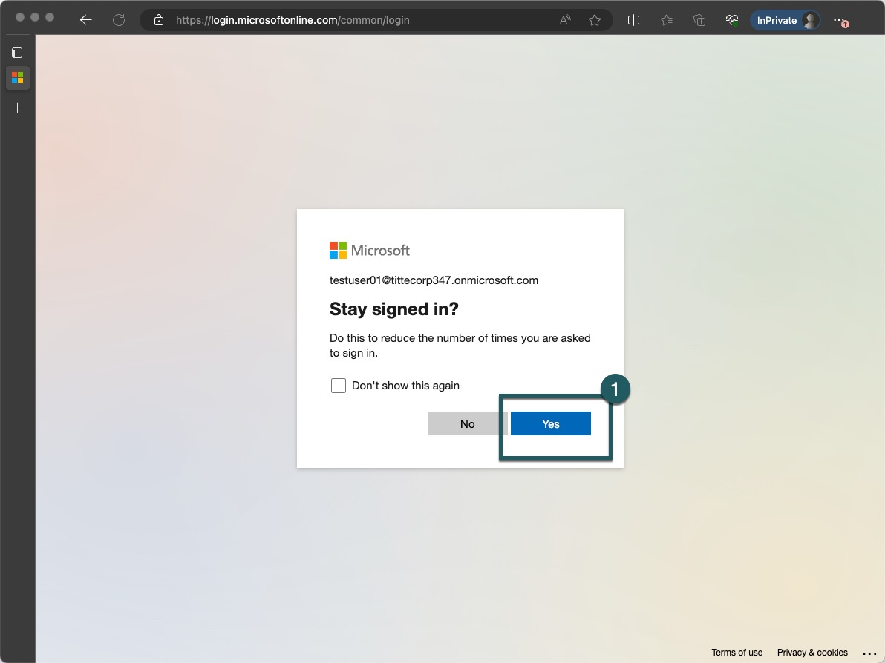

# Start
> [!NOTE]
> Timebox: 30 minutes
> Back to [Agenda](./../README.md#agenda)

## Mandatory steps

1. Review the infographic. 

2. Go to https://fabric.microsoft.com/
3. 

4. 

5. 

6. 

7. 

8. 

9. 

10. 

11. Review the infographic. 

12. Create a Workspace (named as the login you got to fabric)
13. Assign Capacity
14. Check Admin Settings
15. Check Workloads
16. Review the infographic. 

17. Review [Utils and tools](./../README.md#utils-and-tools).

> [!IMPORTANT]
> Once completed, go to [Exercise 1](./../exercise-1/exercise-1.md) or continue with [Advanced steps below](#advanced-steps).

## Advanced steps
TODO

> [!IMPORTANT]
> Once completed, go to [Exercise 1](./../exercise-1/exercise-1.md).