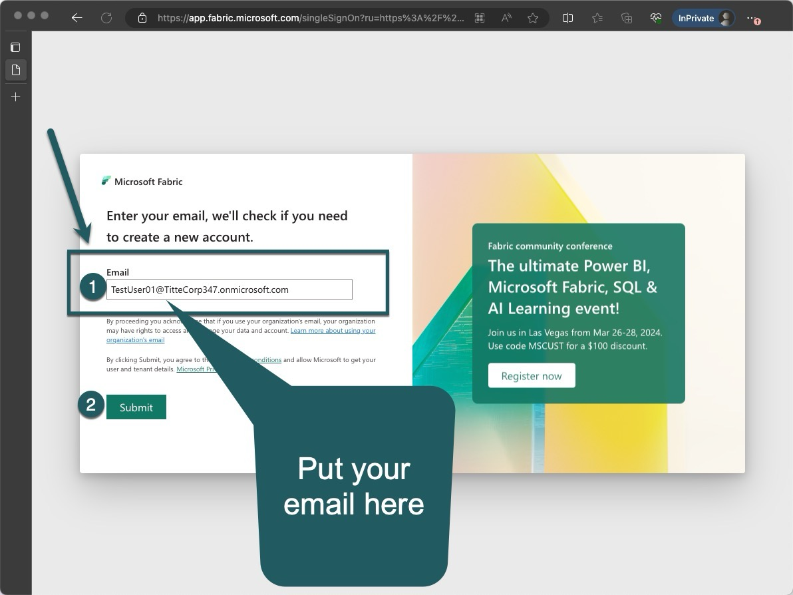
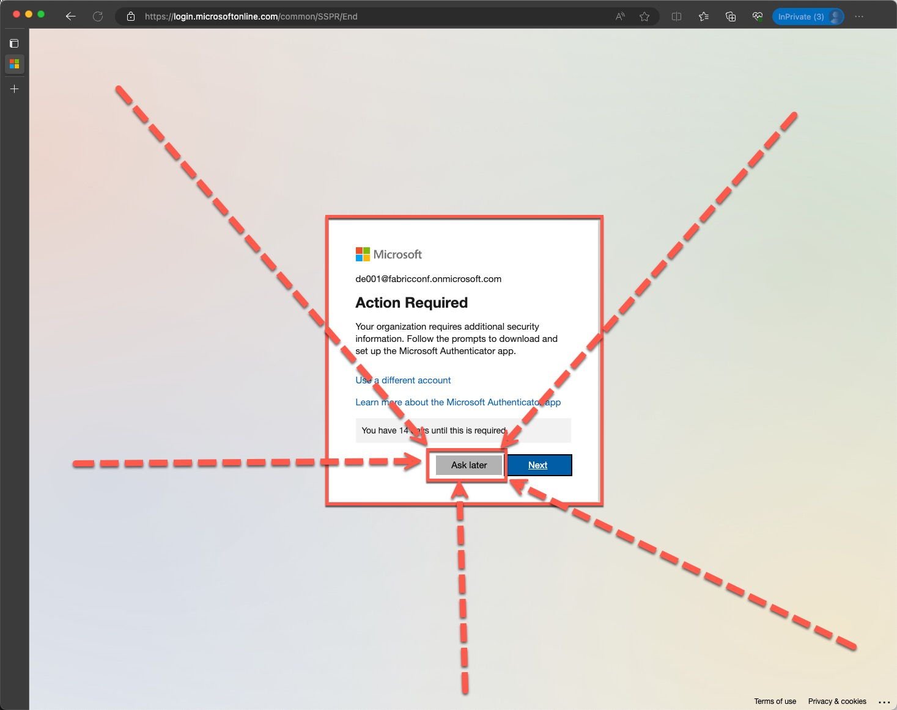
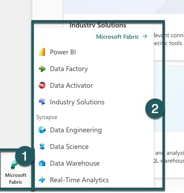
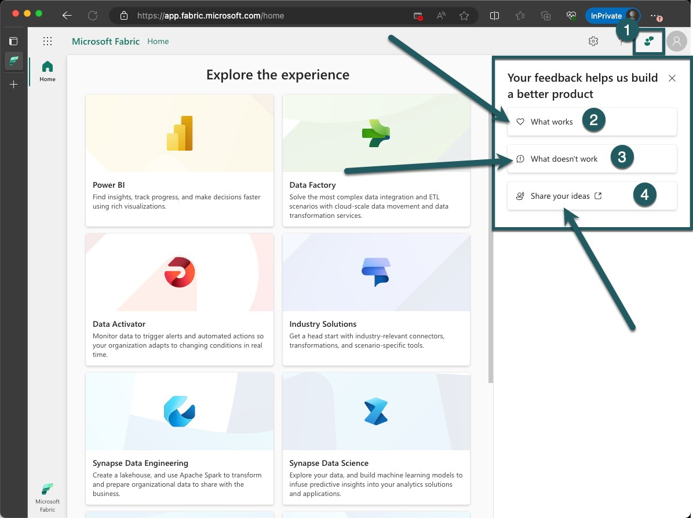
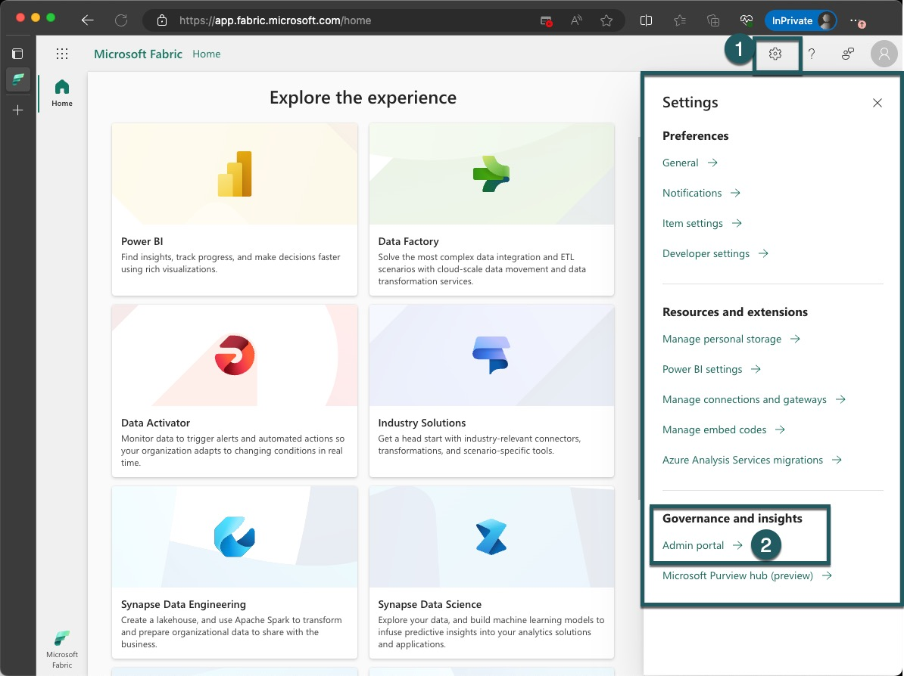
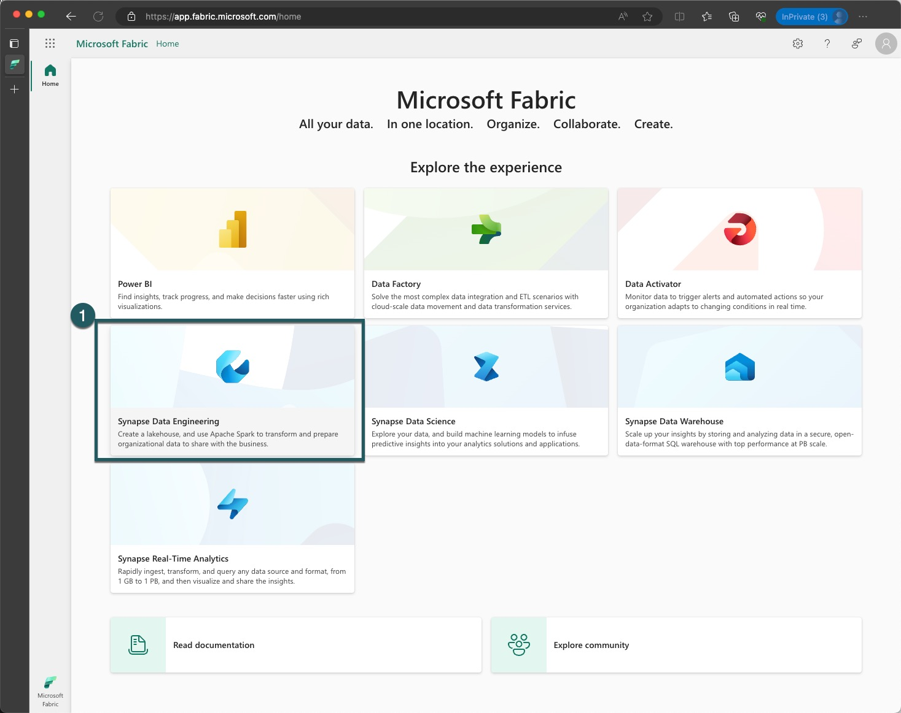
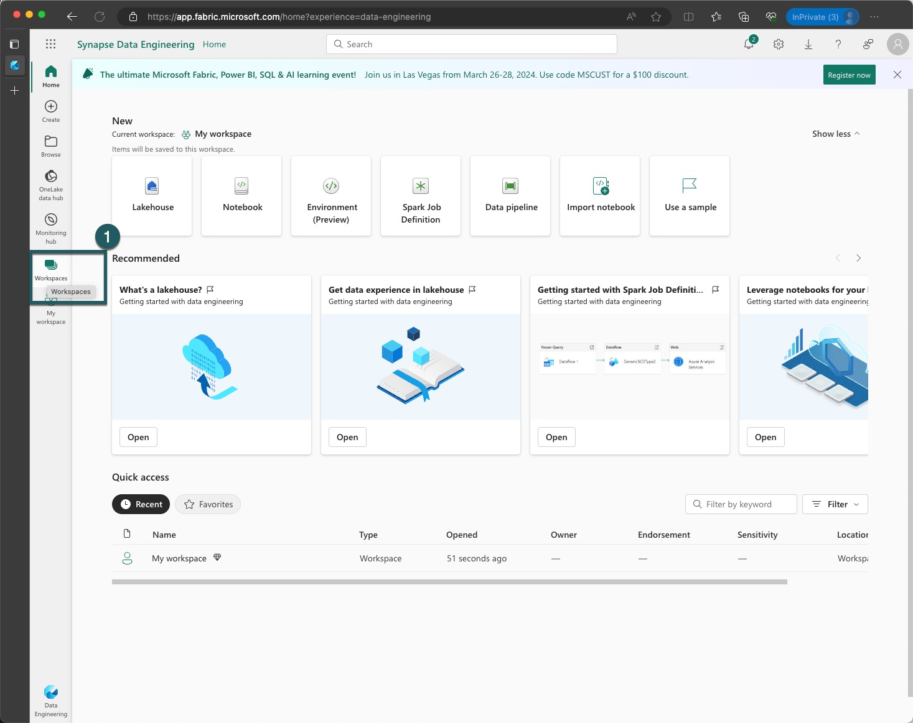
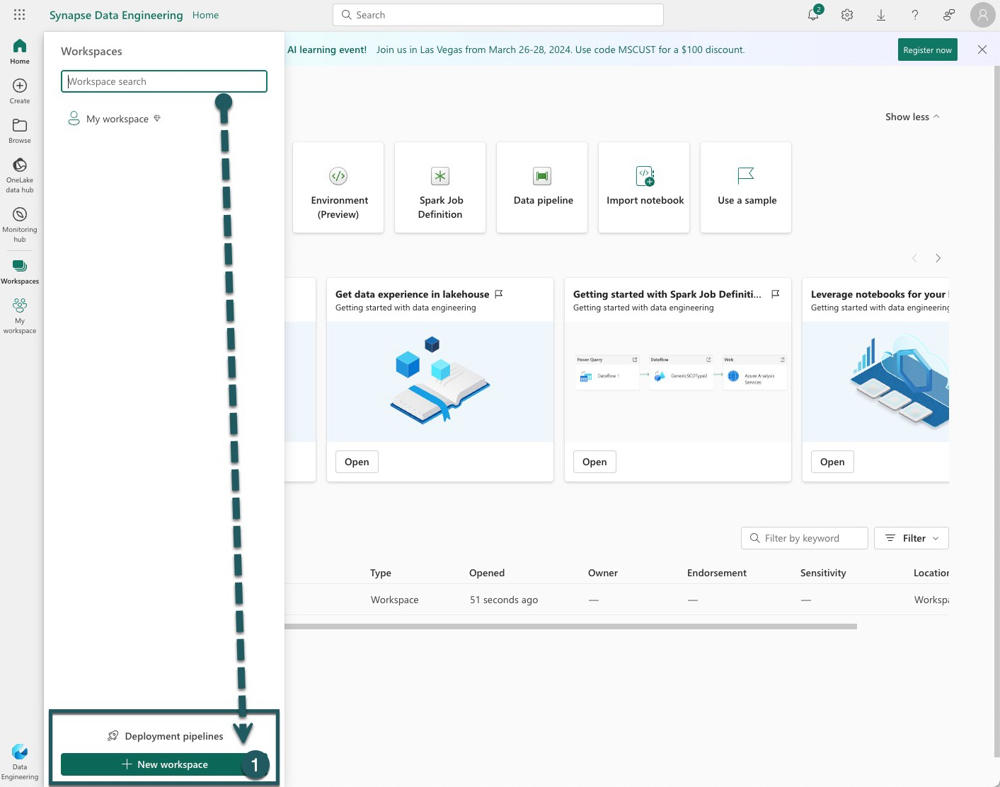
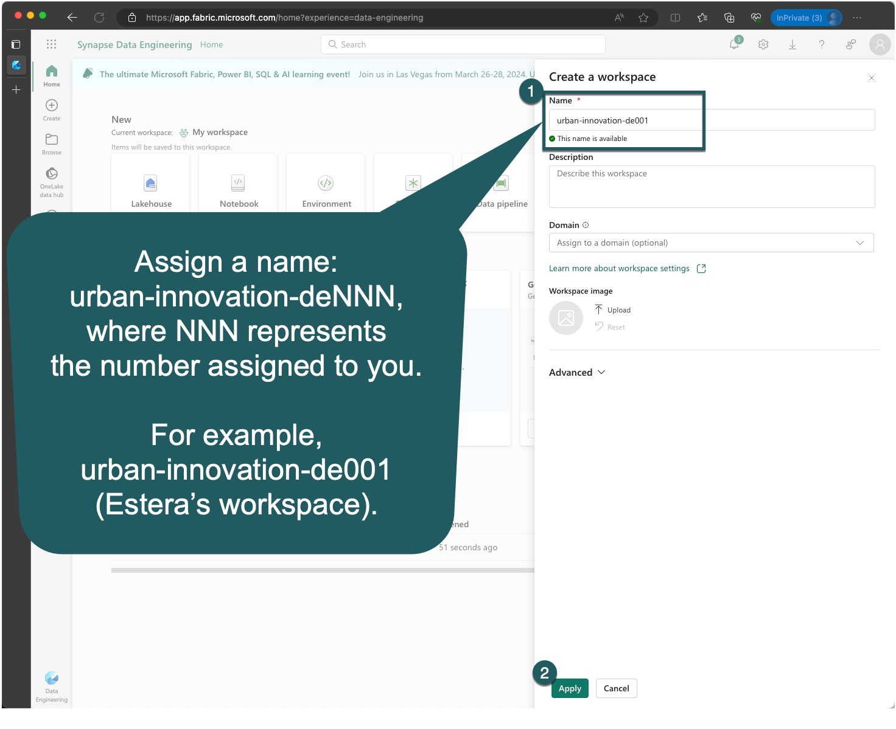
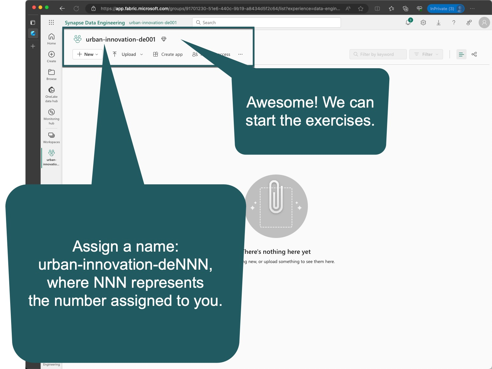

# Start
> [!NOTE]
> Timebox: 30 minutes | [Agenda](./../README.md#agenda)

## 1. Navigate to the Microsoft Fabric Website

> [!TIP]
> We recommend using Incognito mode during this workshop to avoid automatic redirects related to your usual Fabric or Power BI tenants. Incognito prevents the browser from using your default work profile, making it easier to follow along without interruptions.

Visit the Microsoft Fabric website at https://fabric.microsoft.com/.

## 2. Log In with Assigned Credentials
Use the credentials provided on the business card located on your table.

## 3. Enter Your Password and Sign In
Input your password in the designated field and click the `Sign In` button.

## 4. Update Your Password
You are required to update your password upon first login. Please follow the prompts to do so.

## 5. Setup Multi-Factor Authentication (MFA)
As per Tenants' policy, setting up MFA is required. However, you can defer this by selecting `Ask Me Later.`

## 6. Welcome to Microsoft Fabric
You have successfully logged in to Microsoft Fabric!

## 7. Explore Workloads
Click the Microsoft Fabric icon in the bottom left corner to explore available workloads.

## 8. Provide Feedback
Follow the on-screen prompts to navigate the feedback section. You are encouraged to share what works, what doesn't, and suggest new features or improvements. Customer feedback is highly prioritized.

## 9. Explore Help Options
Use the on-screen numbers as a guide to explore all available help options.

## 10. Explore Settings and Admin Portal
Follow the on-screen instructions to explore the settings. Note that while you cannot configure settings due to access restrictions, you are welcome to browse.

## 11. Navigate Back and Create a Workspace
Return to the main screen and click on `Synapse Data Engineering` to begin creating a new workspace.

## 12. Access Workspaces
Click on the `Workspaces` icon located on the left part of the screen.

## 13. Create a New Workspace
A sidebar will appear with a list of all accessible subscriptions. Follow the instructions and click `New Workspace.`

## 14. Name Your Workspace
Give your new workspace a name, adhering to the provided naming convention. Verify the name and click `Apply.` Refer to the [Naming conventions](#naming-conventions) for guidance.

## 15. Workspace Creation Complete
Congratulations, your new workspace has been successfully created! This dedicated space is for you to innovate and build today.

---
# Naming conventions

> [!TIP]
> Please review the naming conventions as that is crucial for all the exercises to run smoothly.

## Workspace name
Assign a name: `urban-innovation-deNNN`, where NNN represents the number assigned to you. For example, `urban-innovation-de001` (Estera’s workspace).

## Bronze Layer (Raw Data Management)
Lakehouse Name: `bronzerawdata`

This is the foundational layer where raw data is ingested directly from various sources, including yellow and green taxi trip records, FHV trip records, and potentially other urban mobility datasets. The data is stored in its original, unmodified form. In the context of your workshop, this involves landing raw TLC Trip Record Data into this layer, ensuring that all raw data remains immutable and traceable for lineage purposes.

## Silver Layer (Refined Data Management)
Lakehouse Name: `silvercleansed`

In this intermediate layer, data is cleansed, standardized, and enriched to resolve inconsistencies and prepare for more detailed analysis. This includes resolving issues with data quality, standardizing formats, and enriching taxi and FHV data with additional contextual information, such as weather conditions or traffic data. The goal here is to create a reliable, query-optimized dataset that supports more efficient analysis and reporting.

## Gold Layer (Curated Data Management)
Lakehouse Name: `goldcurated`

The highest level of the lakehouse, where data is further transformed, modeled, and summarized to support advanced analytics and business intelligence. This layer focuses on deriving actionable insights and supporting high-level decision-making. It could involve aggregating data into meaningful metrics, developing KPIs for urban transportation efficiency, or building machine learning models to predict future trends based on historical patterns.

---

> [!IMPORTANT]
> Once completed, proceed to [Exercise 1](./../exercise-1/exercise-1.md). If time permits before the next exercise begins, consider continuing with [Advanced steps](./../extra/extra.md).
